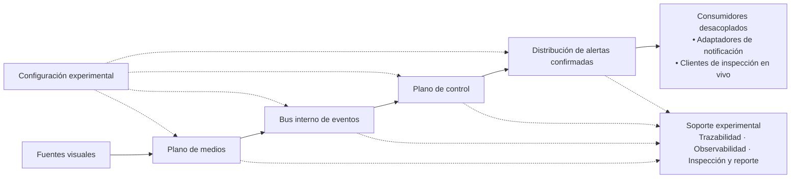
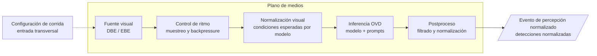
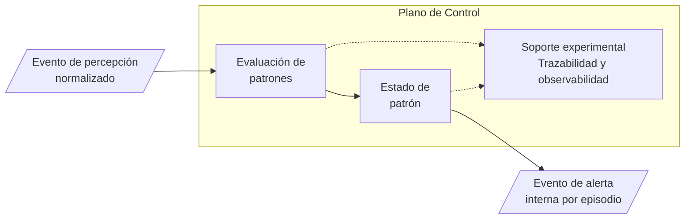
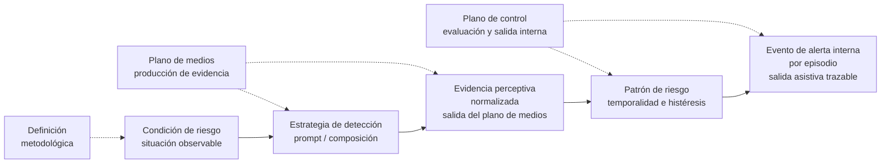
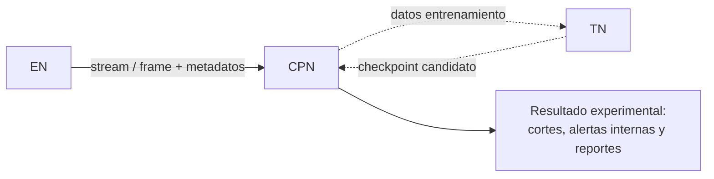

### 17.3.1. Introducción y propósito del capítulo

El presente capítulo desarrolla el diseño arquitectónico de la plataforma experimental E-OVRT-VDP, tomando como punto de partida el alcance metodológico, las condiciones de riesgo, los escenarios de evaluación y las métricas definidas en las secciones anteriores. Su propósito es transformar esas definiciones en una organización técnica capaz de orientar la implementación de la plataforma experimental, manteniendo coherencia con los criterios de modularidad, trazabilidad, medición y control de alcance ya establecidos.

La arquitectura se estructura alrededor de una separación entre el procesamiento visual en tiempo real y la lógica de interpretación posterior. Para ello, se distinguen dos planos principales: el plano de medios, encargado de la ingesta, normalización, inferencia y publicación de resultados perceptivos; y el plano de control, responsable de evaluar patrones de riesgo, registrar alertas asistivas, conservar eventos y producir evidencia reconstruible. Esta división permite proteger la ruta crítica de vídeo y, al mismo tiempo, sostener la trazabilidad experimental necesaria para analizar cada corrida.

El capítulo describe las responsabilidades de los componentes principales, los flujos de información, las fronteras entre módulos, los contratos preliminares, las topologías de ejecución previstas para DBE y EBE, y los criterios de observabilidad que deberán acompañar la implementación. Su finalidad es consolidar una base arquitectónica que permita materializar el prototipo experimental de manera incremental, medible y trazable dentro del alcance experimental definido.

La pregunta que orienta el capítulo puede sintetizarse del siguiente modo: ¿qué arquitectura permite materializar una plataforma experimental de detección open-vocabulary en video en tiempo real, manteniendo modularidad, desacoplamiento, trazabilidad y evaluabilidad dentro del alcance metodológico ya definido?

### 17.3.2. Insumos metodológicos y decisiones derivadas

La arquitectura propuesta se construye a partir de las definiciones metodológicas consolidadas en las secciones anteriores. En particular, toma como insumos el alcance experimental del prototipo, el catálogo de condiciones de riesgo, los escenarios de evaluación, la infraestructura disponible, la estrategia de datos, el framework de métricas y los lineamientos ético-legales. Por lo tanto, los módulos, flujos y límites del sistema no se definen como decisiones aisladas, sino como consecuencia directa del protocolo experimental ya establecido.

En continuidad con el núcleo validable definido previamente, el diseño prioriza las condiciones de Nivel 1, correspondientes a CR-01 y CR-02. Esta decisión permite concentrar la arquitectura inicial en un flujo completo de percepción, publicación de eventos, evaluación de patrones, registro de alertas y medición, sin incorporar como dependencias obligatorias capacidades más complejas como razonamiento espacial, calibración de zonas o seguimiento multiobjeto formal. Las condiciones de mayor complejidad permanecen previstas como extensiones condicionadas, pero no determinan el cierre del primer ciclo funcional del prototipo experimental.

Del mismo modo, la distinción metodológica entre DBE y EBE condiciona la arquitectura desde el inicio. DBE se mantiene como escenario principal para estabilizar la evaluación sobre fuentes controladas y reproducibles, mientras que EBE se incorpora como escenario complementario para observar el comportamiento del sistema con captura o streaming en un entorno controlado. Esta separación obliga a abstraer las fuentes visuales, normalizar la entrada al pipeline y conservar métricas comparables entre escenarios.

A partir de estos insumos, la arquitectura debe asegurar que cada decisión de diseño pueda vincularse con una necesidad metodológica concreta: reproducibilidad de corridas, trazabilidad de eventos, medición de latencia, control de evidencia visual, modularidad de componentes y preservación del alcance experimental. La Tabla 39 sintetiza esta relación entre definiciones previas y decisiones arquitectónicas derivadas.

**Tabla 39**

*Insumos metodológicos y decisiones arquitectónicas derivadas*

| **Insumo metodológico consolidado**   | **Criterio ya definido**                                                                                                                           | **Decisión arquitectónica derivada**                                                                                                                                |
|---------------------------------------|----------------------------------------------------------------------------------------------------------------------------------------------------|---------------------------------------------------------------------------------------------------------------------------------------------------------------------|
| Marco teórico de OVD, MOT y streaming | El sistema debe integrar percepción visión-lenguaje, procesamiento de video y persistencia temporal cuando resulte necesaria.                      | Diseñar una arquitectura modular, con separación de planos, ruta crítica medible y modelos sustituibles mediante adaptadores.                                       |
| Condiciones de riesgo seleccionadas   | El núcleo evaluativo se concentra en condiciones visuales directas, mientras que las condiciones contextuales o relacionales quedan condicionadas. | Priorizar el flujo completo para detección de EPP y mantener reglas espaciales, zonas y tracking como extensiones no bloqueantes.                                   |
| Escenarios DBE y EBE                  | La evaluación combina fuentes controladas reproducibles y captura o streaming en entorno controlado.                                               | Abstraer las fuentes visuales para que ambos escenarios ingresen al pipeline mediante contratos comunes.                                                            |
| Infraestructura CPN, EN y TN          | La inferencia y la evaluación se concentran en el CPN; el EN cumple funciones de captura; el TN queda reservado para adaptación condicionada.      | Evitar que la inferencia OVD pesada en borde sea requisito del flujo base y separar evaluación, captura y entrenamiento.                                            |
| Framework de métricas                 | La evaluación requiere medir detección, rendimiento, latencia, persistencia temporal, alertas y uso de recursos.                                   | Instrumentar timestamps, configuración de corrida, métricas por tramo y eventos reconstruibles desde el inicio del diseño.                                          |
| Lineamientos ético-legales            | El sistema opera como herramienta asistiva, sin reconocimiento de identidad y bajo criterios de minimización visual.                               | Priorizar eventos, metadatos y referencias controladas; conservar evidencia visual sólo cuando esté justificada por validación, auditoría o comunicación académica. |

**Nota.** La tabla sintetiza cómo las definiciones metodológicas ya establecidas condicionan las principales decisiones de diseño arquitectónico. No reitera el protocolo experimental, sino que explicita sus consecuencias sobre la organización del sistema.

### 17.3.3. Alcance, requisitos y decisiones arquitectónicas iniciales

El diseño arquitectónico se formula para un prototipo experimental ejecutado en un entorno local y controlado. En consecuencia, la arquitectura debe orientar la implementación, la medición y la reconstrucción de resultados sin asumir responsabilidades propias de una solución productiva. La sección delimita el alcance efectivo del núcleo validable, las extensiones previstas, las capacidades requeridas, las cualidades no funcionales relevantes y las decisiones iniciales que deberán conservarse durante el desarrollo del prototipo experimental.

#### 17.3.3.1. Alcance del núcleo y extensiones

El alcance arquitectónico se organiza alrededor del núcleo validable definido en la consolidación metodológica. Sobre ese núcleo, la plataforma debe demostrar un flujo completo, medible y trazable desde una fuente visual hasta una alerta asistiva registrada. El objetivo no es ampliar prematuramente la cantidad de condiciones cubiertas, sino asegurar una base suficientemente sólida para procesar evidencia visual, publicar eventos, evaluar patrones, registrar alertas y reconstruir resultados experimentales.

El núcleo incluye las capacidades necesarias para operar sobre fuentes controladas, ejecutar inferencia open-vocabulary, versionar prompts, normalizar detecciones, aplicar reglas temporales simples, registrar eventos y producir métricas comparables. Las capacidades de mayor complejidad —seguimiento multiobjeto formal, reglas espaciales, zonas parametrizadas, preselección liviana en borde o adaptación al dominio— quedan previstas como extensiones condicionadas, siempre que no desplacen la validación inicial ni agreguen dependencias innecesarias al flujo base.

**Tabla 40**

*Alcance del núcleo validable y extensiones condicionadas*

| **Capacidad**                                  | **Tratamiento en Etapa 3**         | **Justificación**                                                                                                     |
|------------------------------------------------|------------------------------------|-----------------------------------------------------------------------------------------------------------------------|
| Detección de condiciones de Nivel 1            | Núcleo validable                   | Permite evaluar el flujo completo sobre condiciones visuales directas y medibles.                                     |
| Gestión de prompts y vocabulario activo        | Núcleo validable                   | Garantiza trazabilidad entre formulaciones, estrategias de detección, umbrales y resultados.                          |
| Reglas temporales de patrón                    | Núcleo validable                   | Transforman detecciones puntuales en evidencia sostenida antes de registrar alertas.                                  |
| Registro persistente de eventos y trazabilidad | Núcleo validable                   | Permite reconstruir corridas, patrones, alertas, métricas y errores relevantes.                                       |
| DBE                                            | Núcleo de evaluación               | Estabiliza inferencia, contratos, eventos y métricas bajo condiciones reproducibles.                                  |
| EBE                                            | Complementario previsto            | Permite observar el comportamiento del sistema con captura o streaming en entorno controlado.                         |
| Condiciones de Nivel 2 y Nivel 3               | Extensiones condicionadas          | Requieren capacidades adicionales de contexto, razonamiento espacial, zonas, proximidad o relaciones entre entidades. |
| MOT formal                                     | Extensión condicionada             | Puede aportar persistencia temporal y soporte para reglas relacionales, pero no es dependencia del núcleo.            |
| Adaptación al dominio (Fine-tuning)            | Rama comparativa condicionada      | Sólo corresponde si existe baseline preentrenado, datos suficientes y partición experimental válida.                  |
| Interfaz de inspección                         | Mínima en el núcleo                | Debe permitir revisar corridas, alertas y métricas sin convertirse en un tablero productivo.                          |
| Evidencia visual controlada                    | Complementario previsto            | Se admite sólo cuando esté justificada por validación, auditoría técnica o comunicación académica.                    |
| Video crudo continuo                           | Fuera del comportamiento ordinario | La trazabilidad principal se apoya en eventos, metadatos, métricas y referencias controladas.                         |

**Nota**. El tratamiento "núcleo validable" identifica capacidades necesarias para el flujo base; "núcleo de evaluación" refiere a la evaluación sobre fuentes controladas; "complementario previsto" agrupa capacidades útiles pero no obligatorias; "extensión condicionada" identifica capacidades previstas sujetas a disponibilidad de datos y módulos; y "rama comparativa condicionada" refiere a variantes que requieren condiciones metodológicas específicas para su incorporación.

La inclusión de la gestión de prompts dentro del núcleo responde a la naturaleza open-vocabulary de la plataforma: cada resultado debe poder asociarse con una formulación, una estrategia de detección y un vocabulario activo registrados. Del mismo modo, la separación entre DBE y EBE permite distinguir la evaluación reproducible de la validación con captura continua, evitando mezclar variabilidad de cámara, iluminación, códec o red con el desempeño propio del detector.

En relación con la evidencia visual, el diseño retoma los criterios ya definidos de minimización, uso asistivo y ausencia de reconocimiento de identidad. La trazabilidad ordinaria se apoya en eventos, metadatos, identificadores, métricas y referencias controladas. Los clips, snapshots o recortes anotados sólo se consideran artefactos complementarios cuando resulten necesarios para validación, revisión técnica o defensa académica.

#### 17.3.3.2. Capacidades arquitectónicas requeridas

A partir del alcance definido, la arquitectura debe habilitar un conjunto mínimo de capacidades que permitan desarrollar un prototipo experimental medible, trazable y extensible. Estas capacidades no describen todavía componentes de implementación, sino responsabilidades que el diseño debe contemplar para que el sistema pueda procesar fuentes visuales, ejecutar inferencia open-vocabulary, evaluar patrones, registrar alertas y producir evidencia experimental.

La clasificación distingue capacidades del núcleo, capacidades asociadas a la evaluación controlada, capacidades complementarias previstas, extensiones condicionadas y ramas comparativas. Esta separación permite ordenar el desarrollo sin convertir funcionalidades deseables en dependencias obligatorias del flujo base.

**Tabla 41**

*Capacidades arquitectónicas requeridas*

| **Capacidad requerida**                 | **Compromiso**                | **Lectura de diseño**                                                                                                                            |
|-----------------------------------------|-------------------------------|--------------------------------------------------------------------------------------------------------------------------------------------------|
| Gestión de corrida reproducible         | Núcleo                        | Cada ejecución debe asociarse a una configuración explícita de fuente, modelo, prompts, umbrales, entorno y versiones.                           |
| Procesamiento DBE                       | Núcleo de evaluación          | Debe operar sobre imágenes, datasets o videos locales para estabilizar inferencia, contratos, eventos y métricas bajo condiciones reproducibles. |
| Procesamiento EBE                       | Complementario previsto       | Debe admitir captura o streaming en entorno controlado para observar el comportamiento operativo del sistema.                                    |
| Normalización de entrada visual         | Núcleo                        | Cada frame debe representarse con metadatos de corrida, fuente, orden temporal, resolución y política de muestreo.                               |
| Inferencia OVD configurable             | Núcleo                        | La arquitectura debe permitir integrar modelos de detección open-vocabulary sin acoplar el sistema a una única alternativa.                      |
| Gestión de prompts y vocabulario activo | Núcleo                        | Debe versionar formulaciones, aliases, estrategias de detección, vocabulario activo y umbrales asociados.                                        |
| Normalización de detecciones            | Núcleo                        | Las salidas heterogéneas de los modelos deben transformarse en detecciones comparables, trazables y aptas para evaluación posterior.             |
| Evaluación de patrones de Nivel 1       | Núcleo                        | Las detecciones deben transformarse en patrones confirmados mediante criterios de persistencia temporal e histéresis.                            |
| Registro de alertas asistivas           | Núcleo                        | Las alertas deben registrarse cuando un patrón alcanza estado confirmado, sin constituir un juicio normativo automático.                         |
| Publicación y persistencia de eventos   | Núcleo                        | La arquitectura debe desacoplar la producción de evidencia perceptiva y conservar un historial reconstruible de eventos relevantes.              |
| Observabilidad y métricas               | Núcleo                        | Debe medir FPS, latencias por tramo, uso de recursos, estados de patrón, alertas, descartes y errores.                                           |
| Reporte experimental                    | Núcleo                        | Debe sintetizar configuración, resultados, métricas, alertas, errores y limitaciones por corrida.                                                |
| Inspección mínima de resultados         | Núcleo                        | Debe permitir revisar corridas, alertas, métricas y evidencia asociada sin convertirse en un tablero operativo avanzado.                         |
| Gestión de evidencia visual controlada  | Complementario previsto       | Debe admitir clips, snapshots o recortes justificados para validación, revisión técnica o comunicación académica.                                |
| Capacidades contextuales y relacionales | Extensión condicionada        | MOT, zonas y reglas espaciales deben quedar previstas para condiciones de Nivel 2 y Nivel 3, sin bloquear el flujo base.                         |
| Comparación de variantes de modelo      | Rama comparativa condicionada | Debe permitir registrar y comparar checkpoints, optimizaciones o variantes ajustadas sólo bajo condiciones experimentales válidas.               |

**Nota**. El compromiso “núcleo” identifica capacidades necesarias para el flujo base; “núcleo de evaluación” refiere a capacidades que sostienen la evaluación controlada; “complementario previsto” agrupa capacidades útiles para validación, revisión o comunicación académica; “extensión condicionada” identifica capacidades previstas pero no obligatorias; y “rama comparativa condicionada” refiere a variantes que sólo deben incorporarse si se cumplen las condiciones metodológicas correspondientes.

#### 17.3.3.3. Requisitos no funcionales de referencia

Las cualidades no funcionales condicionan directamente la validez experimental del prototipo. No alcanza con detectar una condición de riesgo si el sistema no registra la configuración de la corrida, no mide latencia, no conserva trazabilidad suficiente o no controla la evidencia visual generada. Por esta razón, la reproducibilidad, la observabilidad, la privacidad, la modularidad, la integridad de eventos y el control de complejidad se consideran condiciones arquitectónicas del diseño.

**Tabla 42**

*Requisitos no funcionales de referencia*

| **Dimensión**             | **Requisito de diseño**                                                                               | **Implicación arquitectónica**                                                                                                                |
|---------------------------|-------------------------------------------------------------------------------------------------------|-----------------------------------------------------------------------------------------------------------------------------------------------|
| Latencia                  | Acotar la ruta crítica desde la lectura o captura hasta la publicación de eventos de percepción.      | El plano de medios no debe depender de reportes, inspección, persistencia pesada ni notificaciones externas para continuar procesando frames. |
| Reproducibilidad          | Registrar la configuración efectiva de cada corrida.                                                  | Cada ejecución debe conservar fuente, modelo, prompts, umbrales, entorno, versiones y políticas de muestreo.                                  |
| Modularidad               | Permitir la sustitución de fuentes, modelos, prompts, postproceso y motor de patrones.                | Los componentes deben comunicarse mediante contratos explícitos y no mediante estructuras internas acopladas.                                 |
| Trazabilidad              | Reconstruir una alerta a partir de configuración, detecciones, patrón, métricas y evidencia asociada. | Los eventos, identificadores y relaciones causales deben conservar información suficiente para revisión posterior.                            |
| Integridad de eventos     | Evitar pérdida, duplicación o ambigüedad en eventos relevantes.                                       | Los eventos deben incluir identificadores, versión de esquema, orden lógico y asociación con la corrida correspondiente.                      |
| Privacidad y minimización | Proteger configuraciones, métricas, eventos y artefactos visuales conservados.                        | La trazabilidad ordinaria debe apoyarse en eventos y metadatos; los artefactos visuales sólo deben conservarse cuando estén justificados.     |
| Observabilidad            | Medir tiempos, FPS, errores, descartes y uso de recursos desde las primeras corridas.                 | La instrumentación debe formar parte del diseño del pipeline y no quedar como una actividad posterior.                                        |
| Robustez experimental     | Registrar fallas y anomalías sin ocultar su impacto sobre la corrida.                                 | Los errores de fuente, inferencia, publicación, persistencia o medición deben producir registros interpretables.                              |

**Nota**. Los requisitos no funcionales expresan cualidades necesarias para preservar la validez experimental del prototipo. Su finalidad es asegurar comparabilidad entre corridas, trazabilidad de resultados y control de decisiones que puedan afectar latencia, privacidad, reproducibilidad u observabilidad.

#### 17.3.3.4. Decisiones arquitectónicas iniciales

Además de delimitar alcance, capacidades y cualidades no funcionales, el diseño debe explicitar un conjunto de decisiones arquitectónicas iniciales. Estas decisiones no fijan tecnologías concretas, pero establecen reglas estructurales que deberán preservarse durante el desarrollo del prototipo experimental para mantener coherencia con el alcance metodológico, la trazabilidad y la medición de resultados.

**Tabla 43**

*Decisiones arquitectónicas iniciales*

| **ID** | **Decisión**                                                            | **Estado**   | **Justificación**                                                                                                                      |
|--------|-------------------------------------------------------------------------|--------------|----------------------------------------------------------------------------------------------------------------------------------------|
| DA-01  | Separar plano de medios y plano de control.                             | Adoptada     | Protege la ruta crítica de vídeo y desacopla la inferencia de la lógica de interpretación.                                             |
| DA-02  | Publicar evidencia perceptiva como eventos normalizados.                | Adoptada     | Permite desacoplar detecciones, patrones, métricas, alertas y persistencia.                                                            |
| DA-03  | Diferenciar el canal de eventos del repositorio persistente de eventos. | Adoptada     | Separa la integración en ejecución de la reconstrucción experimental posterior.                                                        |
| DA-04  | Confirmar patrones mediante persistencia temporal e histéresis.         | Adoptada     | Reduce alertas generadas por detecciones aisladas, inestables o de corta duración.                                                     |
| DA-05  | Integrar modelos OVD mediante adaptadores.                              | Adoptada     | Permite comparar modelos o variantes sin rediseñar la arquitectura general.                                                            |
| DA-06  | Mantener MOT como módulo opcional.                                      | Condicionada | Puede aportar persistencia temporal o soporte relacional, pero no es dependencia del núcleo de Nivel 1.                                |
| DA-07  | Tratar la adaptación al dominio como rama comparativa condicionada.     | Condicionada | Debe preservar un baseline preentrenado, datos suficientes y particiones experimentales válidas.                                       |
| DA-08  | Adoptar minimización visual como criterio ordinario de trazabilidad.    | Adoptada     | Evita que el almacenamiento indiscriminado de video crudo sea parte del comportamiento base.                                           |
| DA-09  | Separar trazabilidad ordinaria de evidencia visual controlada.          | Adoptada     | Permite conservar clips, capturas o recortes sólo cuando estén justificados por validación, revisión técnica o comunicación académica. |
| DA-10  | Priorizar DBE antes de EBE.                                             | Adoptada     | Estabiliza contratos, inferencia, eventos y métricas antes de incorporar captura continua.                                             |
| DA-11  | Permitir preselección liviana en el nodo de captura como variante EBE.  | Condicionada | Puede reducir carga sobre el nodo central, siempre que no descarte evidencia crítica.                                                  |
| DA-12  | Versionar prompts y vocabulario activo por corrida.                     | Adoptada     | Garantiza la reproducibilidad y comparación entre formulaciones.                                                                       |
| DA-13  | Registrar la alerta interna antes de cualquier notificación externa.    | Adoptada     | Evita que canales externos afecten la medición de la alerta del sistema.                                                               |

**Nota**. Las decisiones adoptadas fijan reglas estructurales del diseño. Las decisiones condicionadas representan capacidades previstas, sujetas a validación y a que no comprometan el núcleo de Nivel 1 del prototipo experimental.

Las decisiones DA-08 y DA-09 deben leerse de manera conjunta. La plataforma no utiliza el almacenamiento continuo de video crudo como mecanismo ordinario de trazabilidad; la reconstrucción experimental se apoya principalmente en eventos, metadatos, identificadores, métricas y referencias controladas. Sin embargo, la validación con captura continua, la revisión técnica o la defensa académica pueden requerir evidencia visual demostrativa. Por ello, se admite la generación de clips breves, snapshots o recortes anotados, siempre que estén justificados y cuenten con criterios explícitos de acceso, retención y anonimización.

La DA-13 complementa esta separación: para el núcleo del prototipo experimental, la alerta válida es el evento interno registrado por la plataforma. Cualquier notificación externa debe tratarse como una salida derivada, no bloqueante y medible por separado.

### 17.3.4. Principios arquitectónicos adoptados

Las decisiones enumeradas en la Tabla 43 se articulan alrededor de cuatro principios que orientarán la lectura del diseño en las secciones siguientes.

El primero es la **separación entre ruta crítica y lógica de control**: la inferencia y la publicación de evidencia perceptiva (DA-01, DA-02) deben mantenerse desacopladas de la evaluación de patrones, la persistencia, los reportes y las notificaciones externas, de modo que ninguna tarea posterior pueda bloquear el procesamiento visual.

El segundo es la **modularidad por contratos**: fuentes, modelos, prompts, detecciones, patrones y métricas deben intercambiarse mediante estructuras explícitas (DA-05, DA-12), evitando dependencias internas que dificulten la sustitución o la evaluación comparativa.

El tercero es la **trazabilidad experimental**: toda alerta debe poder reconstruirse a partir de la configuración de corrida, los eventos perceptivos, el patrón evaluado y las métricas registradas (DA-03, DA-04, DA-13).

El cuarto es la **medición desde el diseño**: tiempos, FPS, descartes, errores y estados de patrón deben instrumentarse desde las primeras corridas, dado que forman parte de la validez experimental del prototipo.

A estos principios se suma el criterio transversal de **evolución incremental**: las capacidades condicionadas (DA-06, DA-07, DA-11) deben incorporarse sin desplazar el núcleo de Nivel 1 ni convertirse en dependencias del flujo base.

### 17.3.5. Vista general de la arquitectura propuesta

La plataforma E-OVRT-VDP se organiza como una arquitectura lógica por bloques, orientada a procesar fuentes de video, generar evidencia perceptiva, evaluar patrones de riesgo y conservar resultados reconstruibles. Esta vista no representa una distribución obligatoria en procesos, servicios o nodos físicos independientes, sino una separación de responsabilidades que permite mantener el sistema modular, medible y trazable.

La arquitectura distingue un flujo principal y un conjunto de capacidades de soporte. La **configuración experimental** actúa de forma transversal sobre ese flujo: define las condiciones de cada corrida —escenario, modelo, prompts activos, umbrales, políticas de evidencia y parámetros de ejecución— para asegurar reproducibilidad sin intervenir directamente en el procesamiento frame a frame.

El flujo principal inicia en las **fuentes de vídeo** —datasets, videos locales, cámaras o flujos de streaming—, cuya responsabilidad es abstraer distintos orígenes de entrada visual bajo una representación común, de modo que el resto de la arquitectura pueda procesarlos de manera uniforme. Desde las fuentes, el flujo continúa en el **plano de medios**, que concentra la ruta crítica de procesamiento visual. Allí se realizan la lectura o captura de frames, el muestreo, la normalización, la inferencia open-vocabulary y el postprocesamiento, con el objetivo de producir evidencia perceptiva normalizada de forma continua y sin dependencia de tareas posteriores. Esa evidencia se publica hacia el **bus interno de eventos**, que actúa como mecanismo de integración desacoplada entre productores y consumidores, separando el procesamiento visual de la evaluación de patrones, el soporte experimental y las salidas derivadas.

A partir de los eventos publicados, el **plano de control** interpreta la evidencia producida por el plano de medios: evalúa patrones, administra estados de corrida y registra alertas asistivas internas cuando se confirma una condición de riesgo. Las alertas ya confirmadas se exponen mediante la **distribución de alertas confirmadas**, un canal de salida desacoplado que permite publicarlas hacia los **consumidores desacoplados** —interfaces de inspección, adaptadores de notificación u otras integraciones— sin bloquear al motor de patrones ni modificar la lógica central del sistema.

Finalmente, la trazabilidad, la observabilidad y la inspección se agrupan en el bloque de **soporte experimental**, que no constituye una etapa lineal del flujo frame a frame sino una capacidad transversal. Este bloque conserva evidencia reconstruible, consolida telemetría técnica y permite revisar corridas, métricas, alertas y resultados experimentales sin interferir con la ruta crítica del plano de medios.

**Figura 4.1**

*Vista conceptual de la arquitectura E-OVRT-VDP*

### Diagrama Mermaid

*Nota.* La figura presenta una vista lógica de alto nivel. Las flechas sólidas representan el flujo principal de datos y eventos; las flechas punteadas representan influencia de configuración o capacidades de soporte. La figura no debe interpretarse como una distribución física obligatoria ni como una asignación definitiva a tecnologías específicas.

En conjunto, esta organización permite que el procesamiento de video, la interpretación de patrones, la distribución de alertas y el análisis experimental se mantengan separados y coordinados mediante contratos explícitos, favoreciendo la reproducibilidad y la evaluación controlada del prototipo.

### 17.3.6. Configuración experimental y diseño de prompts

La configuración experimental concentra las decisiones que gobiernan una corrida de evaluación de la plataforma experimental. Su función es declarar, de manera explícita y reproducible, el escenario, la fuente visual, el modelo OVD, los prompts activos, los umbrales, la política de muestreo, los módulos habilitados, los criterios de patrón, la política de evidencia y la instrumentación de métricas.

Esta sección materializa, en términos arquitectónicos, definiciones establecidas en la consolidación metodológica. Las condiciones de riesgo, los escenarios, las métricas y los criterios de prompting pasan a expresarse como parámetros ejecutables que condicionan al plano de medios y al plano de control. De este modo, cada detección, transición de patrón, alerta interna, métrica o evidencia conservada puede asociarse con una configuración efectiva de corrida.

Dentro de esa configuración, los prompts se tratan como parte del vocabulario activo del experimento. En un sistema open-vocabulary, la consulta textual incide sobre la evidencia perceptiva generada; por lo tanto, debe registrarse, versionarse y mantenerse trazable hasta los resultados que contribuye a producir.

#### 17.3.6.1. Función arquitectónica de la configuración experimental

La configuración experimental actúa como punto de gobierno de la corrida. Antes de iniciar la ejecución, define qué se evaluará, con qué fuente, con qué modelo, con qué vocabulario activo y bajo qué criterios de interpretación. Esta función separa la definición de condiciones de ejecución del procesamiento efectivo de frames y eventos.

La separación protege la ruta crítica del plano de medios. Una vez iniciada la corrida, el pipeline debe disponer de la configuración efectiva sin depender de consultas externas bloqueantes para decidir qué modelo ejecutar, qué prompts utilizar o qué política de muestreo aplicar. La configuración gobierna la ejecución, pero no debe introducir latencia durante el procesamiento continuo.

También delimita la interpretación posterior de resultados. Una detección sólo es experimentalmente útil si puede relacionarse con su fuente, modelo, prompt, umbral, postproceso y patrón evaluado. Sin esa asociación, no sería posible atribuir diferencias de desempeño a una variable concreta de la corrida.

#### 17.3.6.2. Configuración de corrida como artefacto de reproducibilidad

Una corrida reproducible requiere que sus condiciones queden registradas antes de procesar la fuente visual. La finalidad no es anticipar una especificación de producto, sino asegurar que el prototipo produzca evidencia interpretable y comparable.

Dos corridas sólo son comparables si se conoce qué variable cambió y cuáles permanecieron constantes. Por ejemplo, al comparar dos prompts para CR-01, deben preservarse fuente visual, resolución, modelo, umbral, postproceso, política de muestreo, ventana de persistencia y entorno de ejecución. La Tabla 44 resume los elementos mínimos de esta configuración.

**Tabla 44***  
Elementos mínimos de la configuración experimental*

| **Elemento configurable**           | **Contenido esperado**                                                                                                                 | **Función arquitectónica**                                                                                         |
|-------------------------------------|----------------------------------------------------------------------------------------------------------------------------------------|--------------------------------------------------------------------------------------------------------------------|
| Identificación de corrida           | Identificador de corrida, fecha, objetivo, responsable o referencia interna.                                                           | Asocia eventos, métricas, errores, alertas y reportes a una ejecución concreta.                                    |
| Escenario y fuente visual           | DBE o EBE; dataset, video local, imagen, cámara o stream; resolución, FPS, duración y restricciones conocidas.                         | Distingue evaluaciones reproducibles de pruebas con captura o streaming en entorno controlado.                     |
| Parámetros del pipeline             | Resolución de procesamiento, política de muestreo, límite de FPS, tamaño de cola, descartes y período de calentamiento.                | Condiciona latencia, cobertura temporal, frames procesados y lectura de omisiones.                                 |
| Modelo OVD                          | Modelo, versión, checkpoint, backend de inferencia, precisión numérica, dispositivo y adaptador asociado.                              | Permite sustituir o comparar modelos sin acoplar la arquitectura a una implementación específica.                  |
| Prompts y vocabulario activo        | Conjunto de prompts en inglés, condición asociada, variante, versión, estrategia de formulación y umbral vinculado cuando corresponda. | Garantiza trazabilidad entre consulta textual, detección producida y resultado experimental.                       |
| Umbrales y postproceso              | Confianza mínima, IoU/NMS, filtros por clase, tamaño, región o política de normalización.                                              | Define qué salidas crudas del detector se transforman en evidencia perceptiva normalizada.                         |
| Patrones activos                    | Condición evaluada, severidad configurada, ventana de persistencia, histéresis, cooldown y criterio de confirmación.                   | Permite que el plano de control transforme evidencia puntual en estados de patrón y alertas internas por episodio. |
| Capacidades habilitadas y evidencia | Tracker, zonas, preselección en borde, inspección, distribución externa y política de evidencia visual.                                | Evita capacidades implícitas y sostiene la minimización visual de la corrida.                                      |
| Instrumentación y entorno           | Timestamps por tramo, métricas esperadas, criterios de no aplicación, hardware, sistema operativo, librerías y runtime.                | Permite calcular métricas, interpretar diferencias de rendimiento y reproducir corridas equivalentes.              |

***Nota**.* La tabla presenta los elementos mínimos que deben declararse para una corrida experimental. No constituye una especificación cerrada de implementación; los contratos técnicos se refinan en la sección correspondiente a contratos preliminares.

#### 17.3.6.3. Diseño de prompts y vocabulario activo

El diseño de prompts materializa la forma en que las condiciones de riesgo se expresan como consultas consumibles por un modelo OVD. En la metodología previa se trató la sensibilidad de estos modelos a la formulación de la consulta y se reconoció que el prompt no es un detalle accesorio, sino una variable de ingeniería que puede alterar detecciones, falsos positivos, falsos negativos y estabilidad temporal (Du et al., 2022; Zhou et al., 2022).

Para el prototipo, los prompts primarios se formulan en inglés. Esta decisión se apoya en la centralidad de ese idioma en los corpus y modelos visión-lenguaje utilizados como base, como CLIP, Conceptual Captions y CC12M, entrenados o construidos principalmente a partir de pares imagen-texto y recursos web en inglés (Changpinyo et al., 2021; Radford et al., 2021; Sharma et al., 2018). En consecuencia, el documento puede describir las condiciones en español, pero la capa de consulta del detector se diseña en inglés para favorecer la alineación con los patrones lingüísticos dominantes del preentrenamiento.

Cada prompt debe asociarse a una condición de riesgo, un texto de consulta, una estrategia de formulación, una versión y un conjunto de prompts activos. Una modificación de redacción debe registrarse como variante experimental, no como reemplazo informal. Esto permite explicar qué formulación produjo una detección y comparar resultados sin perder vínculo con la condición original.

El vocabulario activo representa el conjunto de prompts habilitados en una corrida. Su tamaño y composición afectan el comportamiento semántico del detector y, según el modelo, el costo de inferencia. Por ello, el núcleo validable debe trabajar con un vocabulario reducido y controlado: suficiente para evaluar sensibilidad de formulación, pero sin habilitar listas amplias que dificulten atribuir resultados.

También debe distinguirse entre prompt y estrategia de detección. Un prompt es una consulta semántica; una estrategia puede combinar prompts, postproceso, evidencia indirecta o reglas espaciales. Esta sección define el diseño y versionado de prompts. La integración entre condición, estrategia de detección, patrón y alerta se desarrolla posteriormente.

#### 17.3.6.4. Diseño inicial de prompts para el catálogo de condiciones

El diseño inicial de prompts contempla el catálogo completo de condiciones de riesgo, pero diferencia su tratamiento experimental. CR-01 y CR-02 conforman el vocabulario principal del núcleo validable. CR-03 y CR-04 se mantienen como candidatos condicionados para explorar evidencia visual parcial. Para CR-05 y CR-06 no se definen prompts integrados de la condición completa, sino consultas sobre entidades o elementos componentes, ya que su evaluación depende de reglas relacionales, zonas parametrizadas, tracking o contexto externo al prompt.

Esta organización permite que la configuración experimental sea completa sin sobredimensionar el prototipo experimental. El vocabulario activo de una corrida puede incluir sólo los prompts del núcleo validable o incorporar consultas adicionales cuando la corrida busque diagnóstico, comparación o evaluación parcial de condiciones condicionadas. En todos los casos, cada prompt debe quedar asociado a una condición de riesgo, una estrategia de formulación, una versión de configuración y un uso previsto.

La Tabla 45 presenta un vocabulario inicial en inglés alineado con el catálogo preliminar de prompts definido en la etapa metodológica. Las formulaciones candidatas no constituyen alertas por sí mismas: sólo producen evidencia perceptiva que el plano de control podrá evaluar como patrón cuando la configuración de corrida habilite los insumos necesarios.

**Tabla 45**  
*Vocabulario inicial de prompts en inglés por condición de riesgo*

| **Condición**                                            | **Eje de consulta**             | **Formulaciones candidatas**                                                                     | **Uso previsto**                                                                                                       |
|----------------------------------------------------------|---------------------------------|--------------------------------------------------------------------------------------------------|------------------------------------------------------------------------------------------------------------------------|
| CR-01 — Persona sin casco                                | Prompt directo de ausencia      | “person without hard hat”; “construction worker without safety helmet”.                          | Vocabulario principal del núcleo validable para producir evidencia sobre ausencia visible de casco.                    |
| CR-01 — Persona sin casco                                | Estado observable               | “person with bare head on construction site”.                                                    | Variante sin negación directa, útil para contrastar sensibilidad del modelo frente al concepto de ausencia.            |
| CR-01 — Persona sin casco                                | Consulta positiva auxiliar      | “person”; “worker”; “hard hat”; “safety helmet”.                                                 | Diagnóstico opcional de presencia de entidad o EPP; no confirma ausencia ni genera alerta por sí sola.                 |
| CR-02 — Persona sin chaleco reflectivo                   | Prompt directo de ausencia      | “person without reflective vest”; “worker without high-visibility vest”.                         | Vocabulario principal del núcleo validable para producir evidencia sobre ausencia visible de chaleco.                  |
| CR-02 — Persona sin chaleco reflectivo                   | Descripción visual              | “person without bright colored safety clothing”.                                                 | Variante orientada a atributos visuales de alta visibilidad.                                                           |
| CR-02 — Persona sin chaleco reflectivo                   | Consulta positiva auxiliar      | “person”; “worker”; “reflective vest”; “safety vest”; “high visibility vest”.                    | Diagnóstico opcional de presencia de entidad o EPP; no confirma ausencia ni genera alerta por sí sola.                 |
| CR-03 — Trabajo en altura sin anticaídas visible         | Consulta candidata compuesta    | “person on scaffolding without harness”; “worker at height without fall protection equipment”.   | Exploración condicionada; requiere contexto espacial y evidencia suficiente para evaluar el patrón completo.           |
| CR-03 — Trabajo en altura sin anticaídas visible         | Consulta descompuesta           | “person on scaffolding”; “person on elevated platform”; “safety harness”; “fall arrest harness”. | Detección separada de persona en altura y elementos de protección para diagnóstico o evaluación parcial.               |
| CR-04 — Borde elevado desprotegido con personas próximas | Consulta candidata compuesta    | “unprotected edge with person nearby”; “elevated platform without guardrail near workers”.       | Exploración condicionada; requiere proximidad, validación espacial y evidencia suficiente del entorno.                 |
| CR-04 — Borde elevado desprotegido con personas próximas | Consulta descompuesta           | “platform edge”; “open edge”; “guardrail”; “safety railing”; “person near edge”.                 | Detección separada de borde, protección colectiva y persona próxima; no confirma el patrón completo por sí sola.       |
| CR-05 — Maquinaria cerca de peatones                     | Entidades de maquinaria         | “excavator”; “backhoe loader”; “dump truck”; “crane”; “heavy machinery”.                         | Detección de entidades componentes; la condición completa requiere proximidad y persistencia temporal entre entidades. |
| CR-05 — Maquinaria cerca de peatones                     | Entidades humanas               | “person”; “construction worker”; “pedestrian”.                                                   | Detección de entidades humanas para evaluación relacional posterior.                                                   |
| CR-06 — Persona en zona restringida                      | Entidad persona                 | “person”; “worker”; “pedestrian”.                                                                | Entidad cuya posición se evalúa contra una zona o polígono declarado en la configuración de corrida.                   |
| CR-06 — Persona en zona restringida                      | Elementos auxiliares de entorno | “restricted area sign”; “caution tape”; “warning tape”; “barrier”; “safety cone”.                | Referencias visuales complementarias; no reemplazan la definición externa de la zona restringida.                      |

***Nota**.* Las formulaciones son candidatas iniciales y deben registrarse por versión. Las consultas indirectas, descompuestas o auxiliares son entradas independientes al detector y su uso depende del modelo y de la configuración de corrida. CR-01 y CR-02 integran el vocabulario principal; CR-03 a CR-06 se mantienen como vocabulario condicionado, ya que su confirmación requiere reglas relacionales, zonas, tracking o contexto externo al prompt.

#### 17.3.6.5. Reglas de comparabilidad entre configuraciones

La configuración debe permitir comparar variantes sin producir conclusiones ambiguas. Al comparar prompts, deben mantenerse constantes modelo, fuente visual, resolución, política de muestreo, umbrales, postproceso y criterios de patrón. Así, una variación de desempeño puede atribuirse razonablemente a la formulación evaluada.

Al comparar modelos OVD, debe conservarse el mismo conjunto de prompts y condiciones equivalentes de fuente, resolución y postproceso. Si un modelo requiere umbrales distintos por la escala de sus puntajes, esa diferencia debe declararse como parte de la configuración y no ocultarse como detalle de implementación.

Al comparar DBE y EBE, debe declararse que cambian la naturaleza de la fuente y la temporalidad. En EBE intervienen captura, decodificación, colas, jitter, descarte por latencia, iluminación y condiciones de red local; por lo tanto, las diferencias observadas no deben atribuirse automáticamente al detector OVD.

#### 17.3.6.6. Validaciones previas al inicio de la corrida

La configuración debe validarse antes de iniciar la ejecución. No debería comenzar una corrida sin fuente visual, modelo OVD seleccionado, vocabulario activo, umbrales mínimos y política básica de registro. Tampoco debería evaluarse una alerta si no existe al menos un patrón activo con criterio de confirmación definido.

Las métricas deben declararse según sus condiciones de aplicación. Una métrica temporal requiere continuidad suficiente y eventos instrumentados; una métrica de tracking requiere tracker habilitado y, si corresponde, anotaciones de identidad; una métrica de distribución externa sólo aplica si la corrida habilita ese canal.

La evidencia visual y los módulos opcionales deben quedar explícitamente habilitados. Snapshots, clips, recortes, tracker, zonas, preselección en EN o distribución externa no deben operar como comportamientos implícitos, porque modifican la interpretación de latencia, cobertura temporal, privacidad o aplicabilidad de métricas.

#### 17.3.6.7. Frontera con los planos de ejecución y el soporte experimental

La configuración define los parámetros que consume el plano de medios: fuente visual, resolución, política de muestreo, modelo OVD, vocabulario activo, umbrales y postproceso. El plano de medios no diseña ni versiona estos elementos; los aplica para producir evidencia perceptiva normalizada y propaga sus referencias en los eventos publicados.

Para el plano de control, la configuración define patrones activos, severidad conceptual, ventanas temporales, histéresis y criterios de confirmación. El plano de control no debe convertir detecciones en alertas por reglas locales no documentadas, sino evaluar la evidencia de acuerdo con lo declarado para la corrida.

Para el soporte experimental, la configuración funciona como clave de reconstrucción. Eventos, métricas, errores, descartes, alertas internas, reportes y evidencia visual asociada deben poder rastrearse hasta la configuración que les dio origen. Con esta delimitación, cada resultado queda asociado a una corrida, cada prompt conserva trazabilidad y cada comparación declara sus variables principales.

### 17.3.7. Diseño conceptual del plano de medios

El plano de medios se materializa en el componente lógico Pipeline de Medios de la plataforma experimental. Este componente concentra la ruta sensible a latencia: inicia cuando la fuente —DBE o EBE— entrega una imagen, un frame o un flujo procesable, y finaliza cuando se publica evidencia perceptiva normalizada hacia la frontera de integración. Su alcance incluye ingesta, decodificación cuando corresponda, control de ritmo, normalización visual, inferencia open-vocabulary, postproceso y publicación no bloqueante.

El límite del componente es estricto. El Pipeline de Medios no confirma condiciones de riesgo, no asigna severidad, no ejecuta reglas de patrón, no genera alertas y no depende de persistencia pesada para continuar procesando frames. Su salida representa evidencia perceptiva primaria asociada a una corrida, una fuente, una referencia temporal, un modelo y una configuración de procesamiento. La interpretación de esa evidencia corresponde al plano de control.

La separación protege la ruta frame-evento frente a tareas que pueden introducir bloqueo o variabilidad, como la evaluación de patrones, la reconstrucción histórica, la generación de reportes, la inspección visual o la distribución de notificaciones externas. La sección precisa cómo debe comportarse el componente que transforma entrada visual en evidencia perceptiva utilizable por el resto del sistema.

DBE y EBE ingresan al Pipeline de Medios mediante una misma frontera conceptual de fuente visual. La diferencia entre ambos escenarios se resuelve en la forma de lectura, disponibilidad del frame, metadatos temporales y política de control de ritmo, no en la salida del plano. En DBE predomina la lectura reproducible; en EBE pueden aparecer colas, atraso acumulado, variabilidad de captura o disponibilidad del último frame. En ambos casos, la salida debe conservar trazabilidad suficiente para reconstruir qué se procesó, bajo qué configuración y con qué resultado.

La configuración experimental actúa como entrada transversal del Pipeline de Medios, pero no es una responsabilidad interna de este plano. Fuente, resolución, política de muestreo, modelo, prompts activos, umbrales y modo de inferencia son definidos por la configuración de corrida. El plano de medios debe consumir esa configuración, aplicarla durante la ejecución y propagar sus identificadores en la evidencia publicada, sin convertirse en el módulo encargado de gobernarla o versionarla.

**Figura x**

*Flujo lógico del Pipeline de Medios*

### Diagrama Mermaid

**Nota.** La figura representa el flujo interno del plano de medios. La configuración de corrida parametriza la ejecución como entrada transversal, sin formar parte del procesamiento frame a frame. El evento de percepción normalizado se ubica por fuera del recuadro para señalar la frontera de salida hacia el bus interno de eventos y el plano de control.

#### 17.3.7.1. Flujo operativo del Pipeline de Medios

El flujo interno del Pipeline de Medios se organiza como una cadena de transformación progresiva. Cada etapa recibe una representación visual o perceptiva, aplica una operación acotada y entrega una salida que mantiene relación con la corrida y con la referencia temporal original. Esta organización permite sustituir fuentes, modelos o políticas de procesamiento sin modificar la responsabilidad general del plano.

**Ingesta y decodificación.** La primera responsabilidad es recibir la entrada visual desde datasets, imágenes, videos locales, cámaras o streams. La fuente debe quedar encapsulada por un adaptador que oculte diferencias de formato sin eliminar información relevante para la evaluación. Cuando la entrada proviene de vídeo codificado o streaming, la decodificación convierte el flujo en frames procesables y registra la información necesaria para distinguir disponibilidad, recepción, orden lógico y referencia temporal. En DBE suele alcanzar con conservar índice de secuencia y orden de lectura; en EBE puede ser necesario registrar además timestamps de captura o recepción, profundidad de cola y eventuales descartes por atraso.

**Control de ritmo y selección de frames**. Antes de ingresar a inferencia, el pipeline debe decidir qué unidades visuales serán efectivamente procesadas. Esta decisión puede consistir en aceptar todos los frames, aplicar FPS fijo, seleccionar cada n frames o priorizar el último frame disponible cuando existe captura continua. Lo importante para el diseño no es imponer una única política, sino evitar decisiones invisibles: todo frame omitido, reemplazado o descartado debe quedar asociado a una causa y a una política declarada en la corrida. La política de muestreo y backpressure se desarrolla luego como decisión específica del plano de medios, dada su incidencia sobre latencia, cobertura temporal y trazabilidad experimental.

**Normalización visual.** El frame aceptado se adapta a los requisitos del modelo seleccionado. Esta etapa puede modificar resolución, formato, espacio de color, disposición de tensores o escala de entrada. El diseño debe preservar la relación entre coordenadas originales y coordenadas de inferencia, porque esa relación permite interpretar cajas delimitadoras, revisar evidencia visual y comparar resultados entre configuraciones con distinta resolución. Reescalado, recortes o letterbox no deben tratarse como operaciones invisibles.

**Inferencia open-vocabulary.** La inferencia ejecuta el detector configurado sobre la entrada normalizada y el conjunto de prompts activos. El modelo se integra mediante un adaptador para evitar que el resto del plano dependa de una salida particular de Grounding DINO, YOLOE u otro candidato. Esta etapa produce resultados crudos: cajas, puntajes, etiquetas, frases asociadas o estructuras equivalentes, según el formato propio del detector utilizado.

**Postproceso y normalización de detecciones.** Luego de la inferencia, el Pipeline de Medios aplica los filtros definidos por la configuración de corrida —umbrales, supresión de detecciones redundantes, normalización de etiquetas y remapeo de coordenadas— para convertir las salidas del modelo en evidencia perceptiva común. Esta salida queda asociada al frame, prompt, condición y nivel de confianza correspondiente, pero no interpreta riesgo ni genera alertas; sólo entrega evidencia normalizada al plano de control.

**Publicación de evidencia perceptiva.** La publicación cierra el plano de medios. La evidencia normalizada se entrega como evento liviano hacia la frontera de integración, asociado a corrida, fuente, referencia temporal, modelo, prompts y timestamps relevantes. A partir de ese punto, la evidencia puede ser evaluada por el plano de control, persistida de manera reconstruible o inspeccionada por componentes de soporte; ninguna de esas tareas debe ser requisito para que el Pipeline de Medios continúe procesando la siguiente unidad visual.

#### 17.3.7.2. Criterios de diseño aplicados al plano de medios

Los criterios de diseño del plano de medios no agregan nuevas decisiones generales respecto de la arquitectura ya definida; traducen esas decisiones al comportamiento específico de la ruta frame-evento. El objetivo es que el procesamiento visual sea medible, sustituible y defendible sin mezclarlo con lógica de patrones, persistencia pesada o salidas externas.

El primer criterio es **mantener una ruta no bloqueante**. La inferencia y la publicación de evidencia no deben esperar indefinidamente a consumidores posteriores. Si el bus interno, la persistencia, la inspección o una salida externa fallan o se saturan, esa condición debe registrarse como parte de la ejecución, pero no debe convertir a esos consumidores en dependencia directa del procesamiento visual.

El segundo criterio es hacer **visible la variabilidad temporal**. En video, una latencia aparentemente baja puede ocultar pérdida de frames, colas saturadas o reemplazo de frames antiguos por frames recientes. Por eso, el Pipeline de Medios debe registrar timestamps por tramo, profundidad de cola cuando corresponda, frames aceptados, frames omitidos y descartes. La pérdida de evidencia no puede quedar fuera de la interpretación experimental.

El tercer criterio es **encapsular la heterogeneidad de modelos**. Los detectores OVD pueden diferir en formato de entrada, tipo de prompt, estructura de salida, semántica de puntajes y costo de inferencia. El plano de medios debe absorber esa heterogeneidad mediante adaptadores y entregar una evidencia perceptiva estable. De ese modo, el plano de control no queda acoplado a un modelo específico ni a detalles internos de su implementación.

El cuarto criterio es **conservar la trazabilidad mínima del resultado perceptivo**. Cada evidencia publicada debe poder asociarse con la corrida, la fuente, la referencia temporal, el modelo utilizado, los prompts activos y la política de procesamiento aplicada. Esta trazabilidad no implica almacenar video crudo de manera continua ni resolver la reconstrucción histórica dentro del plano de medios; implica producir eventos suficientes para que el soporte experimental pueda reconstruir la corrida posteriormente.

El quinto criterio es **no trasladar responsabilidades del plano de control hacia el plano de medios**. La persistencia temporal de un patrón, la histéresis, la severidad y el registro interno de alerta pertenecen al motor de patrones. El plano de medios puede mejorar la calidad de la evidencia perceptiva, pero no debe decidir si una condición observada se convirtió en una situación de riesgo confirmada.

#### 17.3.7.3. Muestreo y control de ritmo en DBE y EBE

La política de muestreo se define por corrida y afecta qué evidencia visual llega a inferencia. En el diseño del plano de medios, esta política no se trata como una optimización secundaria, sino como parte de la configuración que condiciona la lectura de resultados. Cambiar FPS objetivo, salto de frames, tamaño de cola o criterio de descarte equivale a cambiar la variante experimental evaluada.

En corridas DBE, la política adoptada para estabilizar el núcleo validable es procesar todos los frames cuando se trabaja con imágenes, datasets o clips cortos. Si el costo del modelo impide sostener esa ejecución, la corrida puede definirse con un FPS fijo o con una selección cada $n$ frames, siempre que el criterio quede declarado en la configuración y se mantenga constante entre corridas comparables. En este escenario, el énfasis está en preservar reproducibilidad, orden lógico y trazabilidad de las unidades visuales procesadas, más que en simular condiciones de captura continua.

En corridas EBE, el diseño debe priorizar que el atraso acumulado no crezca indefinidamente. Para pruebas orientadas a baja latencia, puede ser preferible procesar el último frame disponible antes que conservar una larga cola de frames antiguos. Para pruebas orientadas a continuidad temporal, puede utilizarse una cola acotada o un FPS fijo. En ambos casos, el tamaño de cola, los descartes, los reemplazos de frame y la diferencia entre tiempo de captura, recepción e inferencia deben quedar registrados.

La preselección liviana en el nodo de captura sólo debe considerarse como una variante de EBE cuando exista una justificación experimental clara. Puede reducir carga sobre el nodo central, pero introduce riesgo de descartar evidencia antes de la inferencia OVD. Si se utiliza, el criterio debe ser conservador, explícito y registrado; de lo contrario, no debe formar parte del flujo base del núcleo validable.

El resultado esperado de esta política no es maximizar FPS de forma aislada, sino hacer interpretable el comportamiento del pipeline. Un sistema que procesa menos frames puede ser válido para una corrida exploratoria o comparativa, pero esa reducción debe ser visible para no confundir rendimiento con cobertura temporal.

#### 17.3.7.4. Relación con configuración, modelos y prompts

El Pipeline de Medios consume la configuración experimental definida para la corrida, pero no la gobierna. Al iniciar la ejecución, recibe los parámetros necesarios para procesar la fuente visual: política de muestreo, resolución de procesamiento, modelo OVD seleccionado, vocabulario activo, umbrales de inferencia y criterios de postproceso. Esta configuración debe permanecer estable durante la corrida, salvo que se registre una nueva configuración experimental.

Los prompts activos funcionan como contexto semántico de la inferencia. El plano de medios no diseña ni valida metodológicamente las formulaciones lingüísticas; utiliza el conjunto declarado en la configuración y conserva su referencia en la evidencia perceptiva publicada. Cuando el modelo lo permita, puede reutilizar representaciones textuales precalculadas o mecanismos equivalentes para reducir costo de inferencia, siempre que esa optimización no altere la trazabilidad de la corrida.

La salida del Pipeline de Medios debe incluir referencias suficientes para reconstruir el origen de cada evidencia: configuración de corrida, fuente, frame o timestamp, modelo utilizado, conjunto de prompts, prompt asociado cuando corresponda, umbrales aplicados y versión del esquema de salida. Esta información no agrega interpretación de riesgo; sólo permite que el plano de control evalúe patrones sobre evidencia trazable y que el soporte experimental explique resultados, omisiones, errores o variaciones de latencia.

En consecuencia, la salida del plano de medios no debe reducirse a cajas y puntajes sin contexto, pero tampoco debe incorporar severidad, confirmación de patrón o decisión de alerta. Su producto es evidencia visual primaria, normalizada y trazable. La interpretación de esa evidencia corresponde al plano de control; la comparación entre configuraciones, modelos y prompts corresponde al análisis experimental posterior.

#### 17.3.7.5. Capacidades opcionales sin desplazar el núcleo validable

El núcleo validable del plano de medios debe poder operar sin exigir seguimiento multiobjeto formal, preselección en borde ni adaptación de modelos al dominio. Estas capacidades pueden incorporarse como variantes del flujo, pero no deben convertirse en requisitos para demostrar el procesamiento básico de CR-01 y CR-02.

El tracking o MOT puede ubicarse después del postproceso cuando resulte necesario estabilizar entidades, reducir oscilaciones entre frames o entregar identificadores temporales al plano de control. Aun así, un identificador temporal no equivale a una condición de riesgo sostenida. La decisión de que una detección persistió durante una ventana temporal sigue perteneciendo al motor de patrones.

Las variantes de ejecución orientadas a eficiencia deben tratarse con el mismo criterio: pueden ser útiles durante la implementación, pero no deben ocupar el centro del diseño conceptual del plano de medios. Reducciones de resolución, cambios de modo de inferencia o exportaciones a motores optimizados corresponden a decisiones de implementación y evaluación posterior; en esta sección sólo interesa fijar que cualquier variante que altere la ruta frame-evento debe quedar declarada en la configuración de corrida.

Con esta delimitación, el Pipeline de Medios queda definido como una ruta de transformación acotada y medible: recibe entrada visual, controla el ritmo de procesamiento, ejecuta inferencia OVD, normaliza resultados y publica evidencia perceptiva. La confirmación de patrones, el registro de alertas y la distribución posterior de salidas quedan fuera de su responsabilidad directa, preservando la separación entre baja latencia y lógica de control.

### 17.3.8. Diseño conceptual del plano de control

El plano de control concentra la interpretación de la evidencia perceptiva producida por el plano de medios. Su responsabilidad comienza cuando ingresa un evento de percepción normalizado y termina cuando el sistema registra estados de patrón, alertas internas, eventos persistibles, métricas y salidas de inspección o distribución desacopladas. A diferencia del Pipeline de Medios, no procesa frames crudos ni necesita operar al ritmo constante de captura; trabaja sobre eventos y sobre cambios de estado derivados de reglas configuradas.

La separación entre detección, patrón y alerta es la decisión arquitectónica central de esta sección. Una detección puntual expresa una observación del modelo sobre una unidad visual; un patrón confirmado expresa que esa evidencia fue evaluada durante una ventana temporal bajo criterios explícitos de persistencia, umbral e histéresis; una alerta interna registra un episodio asistivo generado por una transición válida del patrón. Por lo tanto, el plano de control no debe transformar cada detección en una alerta, sino estabilizar la evidencia antes de producir salidas operativas.

Esta organización evita que la variabilidad propia de la inferencia OVD —falsos positivos, falsos negativos, fluctuación de puntajes, sensibilidad al prompt u oclusiones parciales— se traslade directamente al sistema de alertas. También permite mantener al plano de medios aislado de consumidores lentos, persistencia histórica, reportes, notificaciones externas o interfaces de inspección. El plano de control puede ejecutar esas funciones de forma asíncrona sin bloquear la producción de evidencia perceptiva.

En el alcance del prototipo experimental, el plano de control se orienta principalmente al núcleo validable. Para CR-01 y CR-02, la evaluación puede resolverse mediante persistencia temporal simple y estados de patrón sin exigir seguimiento multiobjeto formal. El tracking, las zonas espaciales o las reglas relacionales pueden enriquecer escenarios posteriores, pero no deben convertirse en una dependencia del núcleo validable.

**Figura x**

*Flujo conceptual del plano de control*

### Diagrama Mermaid

**Nota.** La figura representa el flujo conceptual del plano de control. La configuración de corrida parametriza la evaluación como entrada transversal, sin formar parte del procesamiento evento a evento. El evento de percepción normalizado ingresa desde el plano de medios como entrada externa; dentro del plano se evalúan patrones, se actualizan estados y se derivan registros persistibles y métricas. La alerta interna por episodio se muestra por fuera del recuadro para indicar la frontera de salida del plano de control, quedando disponible para consumidores o adaptadores posteriores.

#### 17.3.8.1. Flujo lógico y responsabilidades del plano de control

El flujo lógico del plano de control puede describirse como una cadena de interpretación sobre eventos. Primero, se recibe evidencia perceptiva normalizada desde el bus interno de eventos. Luego, la evaluación de patrones determina si esa evidencia contribuye a una condición configurada. Si la evidencia acumulada supera los criterios definidos, se produce una transición de estado. Cuando esa transición alcanza el estado confirmado, se registra una alerta interna como episodio asistivo. En paralelo, la persistencia de eventos y la recolección de métricas permiten reconstruir la corrida y analizar su comportamiento.

El bus interno de eventos cumple una función de integración, no de razonamiento. Su tarea es desacoplar productores y consumidores: el plano de medios publica eventos de percepción, mientras que el plano de control los consume para evaluación, persistencia, métricas o inspección. El diseño no exige una tecnología específica de mensajería en esta instancia; exige, en cambio, que el intercambio sea explícito, trazable y no bloquee la ruta crítica de procesamiento visual.

Sobre esa entrada opera la evaluación de patrones, responsable de interpretar la evidencia perceptiva de acuerdo con definiciones de patrón, ventanas temporales, umbrales e histéresis. Esta responsabilidad no ejecuta inferencia visual ni certifica cumplimiento normativo; su función es transformar detecciones puntuales en estados de patrón operativamente interpretables.

Cuando un patrón alcanza una transición válida a estado confirmado, el plano de control registra una alerta interna. Esta alerta no equivale a una notificación externa ni a una acción automática sobre la obra, sino a un evento asistivo trazable que indica que la condición configurada alcanzó los criterios definidos para la corrida. Para evitar duplicaciones, la generación de alertas debe operar por episodios o transiciones de estado, no por cada frame con evidencia positiva.

La trazabilidad se sostiene mediante un repositorio de eventos con escritura append-only, orientado a conservar los hechos relevantes de la ejecución: eventos de percepción consumidos, cambios de estado, alertas internas, resoluciones y referencias a la configuración de corrida. Este repositorio no reemplaza al bus interno ni debe participar en la ruta crítica del plano de medios; su función es permitir reconstrucción experimental, auditoría técnica y análisis posterior de resultados. De manera complementaria, la recolección de métricas y la interfaz mínima de inspección derivan reportes, conteos, estados y evidencia de corrida sin modificar la lógica de activación ni decidir estados de patrón.

#### 17.3.8.2. Evaluación de patrones y máquina de estados

La evaluación de patrones materializa la transición entre evidencia perceptiva y situación operativamente relevante. El plano de control no trabaja sobre frames crudos, sino sobre eventos de percepción normalizados, asociados a una corrida, fuente, referencia temporal, modelo, prompts activos y política de procesamiento. A partir de esa evidencia, evalúa si una condición de riesgo alcanza los criterios definidos en la configuración experimental.

Para CR-01 y CR-02, la evaluación puede mantenerse deliberadamente simple. La evidencia positiva se acumula dentro de una ventana temporal configurable y se contrasta contra criterios de persistencia, confianza mínima e histéresis. El patrón se confirma sólo cuando la evidencia alcanza el umbral definido para la corrida; luego se mantiene activo mientras la señal continúa y se resuelve cuando la ausencia se sostiene durante el margen configurado. Esta estrategia permite estabilizar detecciones sin exigir seguimiento multiobjeto formal en el núcleo validable.

La máquina de estados propuesta distingue cinco momentos conceptuales: sin evidencia, candidato, confirmado, sostenido y resuelto. Esta separación permite evitar que una observación aislada produzca una alerta directa y, al mismo tiempo, permite modelar episodios de riesgo con inicio, confirmación, duración y cierre. La transición a confirmado habilita el registro de una alerta interna por episodio; los estados posteriores actualizan duración, evidencia y métricas sin duplicar la alerta principal.

La confirmación del patrón no debe interpretarse como certificación normativa ni como decisión automática de intervención. Significa que, bajo la configuración de corrida y la evidencia disponible, el sistema alcanzó las condiciones internas de activación. La evaluación final sobre cumplimiento, prioridad de acción o medida preventiva permanece fuera del sistema automatizado y corresponde a la supervisión humana.

**Figura x**

*Máquina de estados conceptual del patrón de riesgo*

### Diagrama Mermaid

***Nota**.* La transición a confirmado registra la alerta interna asistiva. Mientras el patrón permanece sostenido, el sistema actualiza el episodio y sus métricas sin generar alertas principales repetidas. La resolución cierra el episodio y habilita futuras activaciones independientes si vuelve a acumularse evidencia suficiente.

En la lectura de la máquina de estados, el estado sin evidencia representa la ausencia de señales suficientes para activar un patrón. El estado candidato aparece cuando existe evidencia inicial compatible con la condición, pero todavía no se alcanza persistencia o confianza agregada suficiente. El estado confirmado se alcanza cuando la evidencia supera el criterio configurado y habilita el registro de una alerta interna por episodio. Luego, el estado sostenido mantiene activo el episodio mientras la evidencia continúa, actualizando duración, métricas y evidencia asociada sin duplicar la alerta principal. Finalmente, el estado resuelto cierra el episodio cuando la ausencia se mantiene durante el margen definido o se cumple la condición de histéresis, habilitando futuras activaciones independientes.

#### 17.3.8.3. Motor de evaluación de patrones de riesgo

El motor de evaluación de patrones de riesgo es el componente lógico del plano de control encargado de transformar evidencia perceptiva normalizada en estados de patrón, episodios y alertas internas. No procesa imágenes ni ejecuta inferencia OVD; consume los eventos publicados por el plano de medios, consulta las definiciones activas de patrón declaradas en la configuración experimental y actualiza el estado correspondiente dentro de la corrida.

Su función arquitectónica es cerrar la brecha entre detección visual y salida operativa asistiva. Una detección indica que el modelo observó una evidencia en un frame o instante determinado; un patrón confirmado indica que esa evidencia fue evaluada bajo criterios de persistencia, umbral, histéresis y, cuando corresponda, reglas espaciales o contextuales. Por lo tanto, el motor constituye la frontera donde la evidencia perceptiva deja de ser una salida aislada del detector y pasa a formar parte de una interpretación temporal trazable.

El motor se diseña para admitir el catálogo completo de patrones del prototipo, pero su activación efectiva depende de la configuración de corrida, los módulos habilitados y la disponibilidad de evidencia suficiente. De este modo, la arquitectura puede incorporar progresivamente patrones de mayor complejidad sin modificar la lógica central del plano de control.

##### 17.3.8.3.1. Patrón de riesgo como unidad evaluable

El motor no evalúa condiciones de riesgo sueltas, sino patrones de riesgo activos. Cada patrón referencia una condición del catálogo y define cómo esa condición debe ser evaluada durante la corrida. De este modo, la condición conserva el significado semántico del riesgo observado, mientras que el patrón agrega criterios operativos de activación, sostenimiento y cierre.

Esta separación evita que el sistema dependa de reglas rígidas incorporadas directamente en el código. Una misma condición puede evaluarse mediante distintas estrategias de evidencia, umbrales, ventanas temporales o dependencias opcionales, siempre que la configuración experimental lo declare. El patrón funciona, por lo tanto, como una definición evaluable: indica qué evidencia acepta, durante cuánto tiempo debe sostenerse, qué severidad tiene, qué histéresis aplica y qué evento debe emitirse cuando cambia de estado.

El motor opera sobre patrones de riesgo configurados. Cada patrón referencia una condición observable del catálogo CR-01 a CR-06 y define cómo esa condición será evaluada dentro del plano de control: evidencia requerida, ventana temporal, umbrales, histéresis, severidad y dependencias opcionales. En este sentido, la codificación PR-01 a PR-06 se utiliza como recurso de trazabilidad arquitectónica para distinguir la condición observada de la regla operativa que la evalúa.

**Tabla 46**

*Componentes mínimos de una definición de patrón de riesgo*

| **Componente**            | **Contenido esperado**                                                                    | **Función en el motor**                                                                                     |
|---------------------------|-------------------------------------------------------------------------------------------|-------------------------------------------------------------------------------------------------------------|
| Identificación del patrón | Código del patrón, condición de riesgo asociada y versión de definición.                  | Permite rastrear qué regla evaluó la evidencia y bajo qué configuración.                                    |
| Evidencia requerida       | Tipo de detecciones, prompts, entidades o relaciones que pueden alimentar el patrón.      | Define qué eventos de percepción son relevantes y cuáles deben descartarse para ese patrón.                 |
| Criterio temporal         | Ventana de evaluación, duración mínima, frecuencia o proporción de evidencia positiva.    | Evita que una detección aislada active una alerta y permite medir persistencia.                             |
| Umbrales de activación    | Confianza mínima, cantidad mínima de evidencias o criterio agregado de suficiencia.       | Determina cuándo el patrón pasa de candidato a confirmado.                                                  |
| Histéresis y cierre       | Condición de ausencia sostenida, margen de tolerancia o criterio de resolución.           | Evita oscilaciones por oclusiones breves, caídas de confianza o pérdidas momentáneas.                       |
| Severidad configurada     | Nivel conceptual de severidad asociado al patrón dentro de la corrida.                    | Permite interpretar prioridad, latencia esperada y reporte de episodios sin automatizar decisiones humanas. |
| Dependencias opcionales   | Tracking, zonas, reglas espaciales, polígonos, relaciones entre entidades o preselección. | Habilita extensiones condicionadas sin convertirlas en dependencia del núcleo validable.                    |
| Salida esperada           | Transición de estado, alerta interna por episodio, métrica o evento de descarte.          | Conecta evaluación lógica, persistencia de eventos y reconstrucción experimental.                           |

***Nota**.* La tabla presenta componentes lógicos de diseño, no una especificación cerrada de implementación. Los nombres concretos de campos o estructuras se refinan en los contratos preliminares de la arquitectura.

En particular, la severidad no debe derivarse de una detección aislada en un frame, sino de la definición del patrón y del catálogo metodológico consolidado. En el núcleo del prototipo, este valor es estático por corrida: orienta la interpretación de prioridad y latencia esperada, pero no se recalcula frame a frame ni depende de la inferencia OVD, de la publicación de evidencia perceptiva ni de los mecanismos de distribución externa. Cualquier ajuste posterior de severidad por zona, proximidad, persistencia o combinación de condiciones corresponde a extensiones condicionadas y debe declararse explícitamente en la configuración de corrida.

##### 17.3.8.3.2. Memoria temporal y ciclo de evaluación

Durante una corrida, el motor mantiene una memoria temporal asociada a la fuente, la condición evaluada y el patrón activo. Para los patrones del núcleo validable, esta memoria puede organizarse por fuente y condición, sin exigir identidad persistente de persona. Cuando una corrida habilite tracking, zonas o relaciones espaciales, la memoria del motor deberá incorporar esos insumos para diferenciar episodios simultáneos, sostener relaciones entre entidades o aplicar reglas dependientes del contexto.

El ciclo de evaluación se inicia cuando ingresa un evento de percepción normalizado. El motor selecciona las detecciones relevantes para los patrones activos, las agrupa dentro de la ventana temporal configurada y determina si la evidencia acumulada alcanza el criterio definido. Si la evidencia positiva supera el umbral de activación, el patrón puede pasar de candidato a confirmado; si la evidencia continúa, el episodio se mantiene sostenido; y si la ausencia se conserva durante el margen de cierre, el episodio se resuelve.

La histéresis cumple una función central en este ciclo. Un patrón no debe activarse por una detección aislada ni cerrarse por una pérdida momentánea del detector, una oclusión breve o una caída puntual de confianza. Por ello, el motor debe distinguir entre ausencia real de evidencia, descarte por política de muestreo, falla de fuente, pérdida de track cuando corresponda, oscilación del modelo y cierre válido del episodio.

##### 17.3.8.3.3. Evaluación según niveles de complejidad del catálogo

El motor debe respetar la clasificación metodológica de condiciones por nivel de complejidad ya definida en el desarrollo metodológico. Desde el diseño arquitectónico, esa clasificación se traduce en distintos requisitos de evaluación: algunos patrones pueden resolverse con evidencia perceptiva y persistencia temporal simple, mientras que otros sólo deben activarse cuando la corrida habilite insumos adicionales como tracking, zonas parametrizadas o reglas espaciales.

Esta diferenciación permite diseñar un motor único sin sobredimensionar el prototipo experimental. La arquitectura mantiene una lógica común de evaluación, pero adapta sus entradas y criterios según el patrón activo y la configuración de corrida. De este modo, el plano de control puede incorporar condiciones más complejas sin rediseñarse, siempre que existan los insumos necesarios para evaluarlas de manera trazable.

**Tabla 47**

*Diseño del motor de patrones según condición de riesgo*

| **Patrón y condición asociada**                                  | **Evidencia y regla de evaluación**                                                                                                                                                                        | **Dependencias arquitectónicas**                                                                                         | **Tratamiento en el prototipo**                                                                                                          |
|------------------------------------------------------------------|------------------------------------------------------------------------------------------------------------------------------------------------------------------------------------------------------------|--------------------------------------------------------------------------------------------------------------------------|------------------------------------------------------------------------------------------------------------------------------------------|
| PR-01 / CR-01 — Persona sin casco                                | Evidencia OVD directa de persona sin casco o evidencia auxiliar de persona y casco. El motor acumula evidencia positiva por fuente y ventana temporal, aplica confianza mínima, persistencia e histéresis. | Plano de medios con prompts activos, postproceso normalizado y timestamps. No requiere MOT formal para el núcleo.        | Núcleo validable obligatorio. Debe producir patrón candidato, confirmado, sostenido, resuelto y alerta interna por episodio.             |
| PR-02 / CR-02 — Persona sin chaleco reflectivo                   | Evidencia OVD directa de persona sin chaleco reflectivo o evidencia auxiliar de persona y chaleco. El motor evalúa persistencia temporal bajo umbral y cierre configurado.                                 | Plano de medios con prompts activos, postproceso normalizado y timestamps. No requiere MOT formal para el núcleo.        | Núcleo validable obligatorio. Se evalúa con la misma lógica base que PR-01, ajustando prompts y umbrales por condición.                  |
| PR-03 / CR-03 — Trabajo en altura sin anticaídas visible         | Evidencia de persona en altura o sobre estructura elevada, junto con ausencia o baja evidencia de sistema anticaídas visible. El motor requiere validar contexto espacial antes de confirmar.              | OVD sobre entidades o atributos, reglas espaciales intra-frame y evidencia visual suficiente del escenario.              | Extensión condicionada. No bloquea el núcleo; sólo debe activarse si existen datos o escenas que permitan evaluar la condición completa. |
| PR-04 / CR-04 — Borde elevado desprotegido con personas próximas | Evidencia de borde, plataforma o zona elevada, ausencia de baranda o protección colectiva y presencia de personas próximas. El motor evalúa proximidad y condición de protección.                          | OVD de entidades del entorno, reglas espaciales, posible parametrización de regiones y cámara con perspectiva adecuada.  | Extensión condicionada. Puede reportarse parcialmente si sólo se detectan componentes visuales sin validar la condición completa.        |
| PR-05 / CR-05 — Maquinaria cerca de peatones                     | Evidencia de maquinaria y personas con relación de proximidad sostenida. El motor evalúa distancia relativa, duración del acercamiento y persistencia del episodio.                                        | OVD de entidades, seguimiento temporal o asociación equivalente, reglas de proximidad y métricas de continuidad.         | Condicionado a módulo contextual. No pertenece al núcleo; requiere instrumentación temporal y control de falsos positivos relacionales.  |
| PR-06 / CR-06 — Persona en zona restringida                      | Evidencia de persona dentro de un polígono o zona definida externamente. El motor evalúa permanencia, entrada, salida y cierre por ausencia sostenida.                                                     | Cámara fija o geometría controlada, polígono de zona, OVD de persona y, preferentemente, tracking o asociación temporal. | Condicionado a escenario EBE controlado o fuente fija. Requiere parametrización explícita de zona en la configuración de corrida.        |

***Nota**.* La tabla diseña el comportamiento esperado del motor frente al catálogo completo de patrones. El tratamiento “núcleo validable” identifica patrones obligatorios para el prototipo experimental; el tratamiento “extensión condicionada” indica capacidades previstas que sólo deben habilitarse cuando existan datos, módulos e instrumentación suficientes.

##### 17.3.8.3.4. Salidas, episodios y trazabilidad del motor

La salida principal del motor no es una alerta aislada, sino una secuencia de eventos derivados que describen el ciclo de vida del patrón: inicio de candidato, confirmación, sostenimiento, resolución o descarte por evidencia insuficiente. La alerta interna se registra sólo cuando una transición válida confirma el patrón. Esta decisión evita que el sistema emita alertas por cada frame positivo y permite analizar episodios con inicio, duración, evidencia causal y cierre.

Cada transición debe conservar trazabilidad suficiente para explicar su origen: configuración de corrida, patrón evaluado, condición asociada, evidencia considerada, ventana temporal, umbrales aplicados, estado previo, estado nuevo y referencia temporal. Esta información permite reconstruir por qué una alerta fue generada, por qué un episodio se resolvió, qué evidencia fue descartada y qué parámetros condicionaron el resultado.

Las métricas operativas del plano de control se apoyan en estas transiciones. El tiempo hasta la primera detección se vincula con la primera evidencia perceptiva relevante; la latencia de alerta interna se vincula con la transición a confirmado; la tasa de detección sostenida se vincula con la continuidad del episodio; y los errores o descartes permiten distinguir una ausencia real de evidencia de una falla técnica o una pérdida por muestreo.

De esta manera, el motor de evaluación de patrones permite que la arquitectura sostenga una cadena operativa completa: detección OVD, evidencia perceptiva normalizada, patrón candidato, patrón confirmado, alerta interna por episodio, sostenimiento, resolución y reconstrucción experimental. Con este diseño, CR-01 y CR-02 pueden implementarse como núcleo validable, mientras que los patrones más complejos permanecen incorporables sin alterar la separación entre plano de medios y plano de control.

#### 17.3.8.4. Transporte, persistencia y trazabilidad experimental

El diseño distingue el transporte de eventos de la persistencia histórica. El bus interno de eventos permite que productores y consumidores intercambien eventos durante la ejecución; el repositorio de eventos conserva una secuencia inmutable de hechos relevantes para reconstrucción experimental. Confundir ambas responsabilidades conduciría a dos riesgos opuestos: convertir la ruta de ejecución en una operación dependiente de almacenamiento pesado o, en sentido contrario, perder trazabilidad al tratar el bus como si fuera un registro histórico suficiente.

El repositorio de eventos debe funcionar bajo una lógica append-only. En lugar de sobrescribir estados, conserva hechos: evidencia recibida, patrón candidato, patrón confirmado, alerta interna registrada, episodio sostenido, episodio resuelto, errores de publicación, descartes relevantes y métricas de ejecución. Esta estructura permite reconstruir por qué una alerta ocurrió, qué evidencia la sostuvo, bajo qué configuración se ejecutó y qué condiciones de ausencia permitieron resolverla.

La trazabilidad es especialmente importante en un prototipo experimental. Permite comparar corridas con modelos, prompts, umbrales o políticas de muestreo diferentes; analizar falsos positivos y falsos negativos; justificar métricas temporales; y revisar decisiones sin depender de memoria volátil ni de capturas informales. En consecuencia, la persistencia no se incorpora como una función administrativa secundaria, sino como parte de la validez experimental del diseño.

Sobre los eventos persistidos pueden construirse proyecciones consultables para inspección, métricas o reportes. Estas proyecciones no reemplazan al historial append-only: funcionan como vistas derivadas que facilitan la lectura del estado actual, el resumen de episodios, el cálculo de indicadores o la revisión posterior de una corrida. Si una proyección se descarta o se recalcula, la secuencia causal de eventos debe seguir disponible en el repositorio.

Los adaptadores externos, cuando existan, deben ubicarse por fuera del plano de control y de su ruta crítica. Su función es consumir salidas ya producidas por el plano —por ejemplo, alertas internas o estados derivados— y transformarlas en notificaciones, integraciones o mensajes hacia otros canales. No definen la semántica de la alerta, no condicionan la evaluación de patrones y no participan en la persistencia principal de la corrida. De este modo, un consumidor lento, fallido o no instrumentado no afecta la activación interna, la conservación de la evidencia ni la reconstrucción experimental.

### 17.3.9. Integración entre condición, estrategia de detección, patrón y alerta

Esta sección precisa cómo las condiciones de riesgo definidas metodológicamente se materializan dentro de la arquitectura. Su finalidad es vincular la condición observable con una estrategia de detección, la evidencia perceptiva publicada por el plano de medios, la evaluación del patrón en el plano de control y el registro de una alerta interna por episodio. De este modo, la plataforma evita tratar los prompts como condiciones completas o las detecciones individuales como alertas directas, conservando una cadena causal trazable entre percepción, evaluación y salida asistiva.

#### 17.3.9.1. Cadena de traducción arquitectónica

La cadena de traducción comienza con una condición observable del catálogo metodológico. Esa condición define qué fenómeno se desea monitorear, pero no determina por sí misma cómo debe detectarse. La estrategia de detección cumple esa función: establece si la evidencia se buscará mediante un prompt directo, una combinación de consultas, evidencia auxiliar o reglas contextuales habilitadas por la configuración de corrida.

El plano de medios aplica la estrategia configurada y publica evidencia perceptiva normalizada. Esa evidencia queda asociada a la corrida, la fuente, el modelo, los prompts activos, los umbrales y la referencia temporal correspondiente. Sin embargo, todavía no constituye una alerta. Su función es alimentar al plano de control con información comparable y trazable.

El plano de control evalúa esa evidencia mediante el patrón de riesgo correspondiente. Allí se aplican criterios de persistencia, histéresis, severidad configurada y, cuando corresponda, reglas espaciales o temporales adicionales. Sólo cuando el patrón alcanza una transición válida a confirmado se registra una alerta interna por episodio. Esta alerta es una salida asistiva del sistema y no equivale a una notificación externa ni a una certificación normativa.

**Figura x**

*Cadena de traducción entre condición, estrategia, evidencia, patrón y alerta*

### Diagrama Mermaid

**Nota.** La figura muestra cómo una condición definida metodológicamente se materializa en la arquitectura. La estrategia orienta la producción de evidencia en el plano de medios; el patrón evalúa esa evidencia en el plano de control; y la alerta interna registra el episodio confirmado.

#### 17.3.9.2. Estrategia adoptada para el núcleo validable

Para el núcleo validable, la estrategia adoptada es la detección directa de condiciones de EPP mediante prompts configurados para CR-01 y CR-02. Esta decisión permite evaluar si un modelo OVD preentrenado produce evidencia suficiente sobre ausencia visible de casco o chaleco reflectivo, utilizando formulaciones controladas como parte del vocabulario activo de la corrida. La salida esperada de esta estrategia no es una alerta, sino evidencia perceptiva normalizada que será evaluada posteriormente por el motor de patrones.

La estrategia directa se adopta como punto de partida porque reduce dependencias arquitectónicas y permite cerrar una primera cadena experimental trazable. No requiere tracking formal, definición de zonas, reglas espaciales ni composición de múltiples entidades. Su función es producir evidencia mínima suficiente para que el plano de control evalúe persistencia, histéresis y confirmación del episodio.

Las consultas auxiliares positivas, como persona, casco o chaleco, pueden habilitarse con finalidad diagnóstica o comparativa. Su uso permite analizar falsos positivos, falsos negativos o ambigüedades visuales, pero no reemplaza la estrategia directa ni confirma por sí mismo una ausencia. Si se utilizan, deben declararse en la configuración de corrida y mantenerse separadas de la evidencia principal que alimenta el patrón.

Las estrategias indirectas, combinadas o contextuales quedan previstas como variantes configurables. Su incorporación sólo corresponde cuando la corrida habilite los insumos necesarios, como reglas espaciales, zonas, tracking o relaciones entre entidades. En todos los casos se conserva la misma cadena arquitectónica: la estrategia produce evidencia, el patrón evalúa relevancia operativa y la alerta interna registra el episodio confirmado.

#### 17.3.9.3. Trazabilidad de la cadena causal

Para que la integración sea reconstruible, cada evidencia publicada debe conservar vínculo con la condición que intenta representar, la estrategia de detección utilizada y la configuración efectiva de corrida. Esta relación permite explicar por qué una evidencia fue producida, omitida, descartada o incorporada a la evaluación de un patrón.

Del mismo modo, cada transición de patrón debe poder vincularse con la evidencia que la originó. La confirmación no es un hecho aislado: depende de detecciones acumuladas, criterios de persistencia, histéresis, severidad configurada y reglas activas. Por ello, la alerta interna debe poder reconstruirse desde la cadena completa: condición observable, estrategia de detección, evidencia perceptiva, patrón evaluado y transición a confirmado.

Esta trazabilidad permite comparar variantes sin alterar la semántica del sistema. Una misma condición puede evaluarse con distintas estrategias, siempre que la corrida declare la variante utilizada y los eventos resultantes conserven esa referencia.

### 17.3.10. Distribución de alertas confirmadas

La distribución de alertas confirmadas es el bloque que expone una alerta interna ya registrada hacia consumidores de inspección, reporte o integración experimental. Su importancia es operativa: permite que el resultado asistivo llegue a una interfaz, canal o sistema externo sin alterar la cadena causal que lo originó.

En la arquitectura propuesta, la unidad distribuida no debe tratarse como una nueva alerta, sino como un evento derivado de la alerta interna. Esta decisión permite distinguir tres hechos: la confirmación del episodio dentro del plano de control, el intento de distribución y el resultado de entrega o falla del canal habilitado.

La distribución se habilita por configuración de corrida y se mide como trayecto posterior. Una demora, error o ausencia de consumidor externo puede afectar la comunicación de la alerta, pero no modifica la validez del episodio confirmado ni la métrica principal de alerta interna.

#### 17.3.10.1. Función arquitectónica de la distribución

La distribución se activa a partir de una alerta interna confirmada. Toma el evento de alerta y construye una salida con contexto mínimo: corrida, patrón, condición asociada, severidad configurada, instante de confirmación, estado del episodio y referencias de evidencia cuando existan. Su función es comunicar o exponer un hecho ya producido por el plano de control, no volver a evaluarlo.

El diseño debe preservar una frontera estricta, primero se confirma el patrón y luego se distribuye la alerta. Un canal de mensajería, una interfaz de inspección o un adaptador externo no debe recalcular severidad, modificar estados de patrón ni crear alertas principales independientes. Si un consumidor falla, la arquitectura debe registrar la anomalía de distribución y mantener intacto el evento interno original.

Bajo esta delimitación, la distribución cumple una función asistiva y experimental. Puede orientar la atención humana, facilitar revisión de resultados o alimentar integraciones controladas, pero no constituye una decisión normativa ni una acción automática sobre la obra.

#### 17.3.10.2. Consumidores y adaptadores de salida

Las alertas confirmadas pueden exponerse hacia consumidores desacoplados. La arquitectura no impone un único canal ni convierte la notificación externa en requisito del núcleo validable. Cada consumidor debe declararse en la configuración de corrida, operar sobre alertas ya confirmadas y conservar la relación con el evento interno que le dio origen.

Los consumidores pueden cumplir finalidades distintas: inspección, reporte, comunicación asistiva o integración con herramientas externas. En todos los casos, deben trabajar con información controlada y no requerir acceso directo a frames crudos ni a estructuras internas del motor de patrones.

**Tabla 48**

*Tipos de consumidores para alertas confirmadas*

| **Consumidor o adaptador** | **Uso previsto**                                                                                                                 | **Tratamiento arquitectónico**                                                                                      |
|----------------------------|----------------------------------------------------------------------------------------------------------------------------------|---------------------------------------------------------------------------------------------------------------------|
| Interfaz de inspección     | Visualizar alertas confirmadas, estado de episodio, métricas y evidencia asociada cuando exista.                                 | Consumidor derivado; no modifica patrones ni confirma alertas.                                                      |
| Reporte experimental       | Incorporar alertas confirmadas en el resumen de corrida, junto con configuración, métricas, errores y límites de interpretación. | Proyección posterior basada en eventos persistidos y señales observables.                                           |
| Mensajería asistiva        | Enviar una notificación breve a un canal humano configurado, como soporte de revisión o atención.                                | Adaptador opcional; su latencia y errores se miden por separado de la alerta interna.                               |
| MQTT o integración IoT     | Publicar una alerta confirmada hacia un broker o sistema experimental externo.                                                   | Canal de integración; no debe accionar automáticamente sin supervisión humana ni alterar la semántica de la alerta. |
| Webhook o salida técnica   | Integrar pruebas con otros componentes, herramientas de validación o servicios experimentales.                                   | Extensión opcional sujeta a configuración, observabilidad y control de errores.                                     |

**Nota**. La tabla presenta consumidores de alertas confirmadas, no componentes obligatorios del núcleo validable. Cada canal debe habilitarse por configuración de corrida y medirse como salida posterior a la alerta interna del sistema.

#### 17.3.10.3. Medición, errores y límites de interpretación

Cuando una corrida habilita distribución, la arquitectura debe registrar eventos de intento y resultado de entrega. Este registro no constituye un consumidor de alertas sino un mecanismo de observabilidad propio del tramo de distribución: permite diferenciar alerta confirmada, intento de distribución y entrega efectiva sin alterar la semántica del evento interno que le dio origen. A su vez, cada registro debe conservar la relación con la alerta interna original, el canal utilizado, el timestamp, el estado de entrega, los reintentos y el error producido si corresponde. Esta información permite reconstruir qué ocurrió después de la confirmación del patrón sin confundirlo con la activación interna del sistema.

La métrica principal de alerta corresponde al tiempo hasta la alerta interna confirmada. La latencia de distribución pertenece a un tramo posterior y sólo aplica cuando existe un consumidor habilitado. Si no se configura un canal externo, esa métrica debe declararse no aplicable; si el canal falla, la alerta interna sigue siendo válida y la entrega se registra como fallida o limitada.

Los reintentos de envío deben asociarse a la misma alerta interna y no generar nuevos episodios. Del mismo modo, una demora de notificación no debe reinterpretarse como demora del motor de patrones. La arquitectura debe conservar la diferencia entre alerta registrada, intento de distribución, entrega confirmada, entrega fallida y canal no habilitado.

Con este tratamiento, la distribución conecta el prototipo experimental con revisión humana, inspección e integraciones controladas sin ampliar la semántica de la alerta. El sistema conserva como hito principal la alerta interna y trata cualquier comunicación posterior como trayecto derivado, observable y opcional.

### 17.3.11. Contratos preliminares e interfaces internas

La arquitectura propuesta requiere que las responsabilidades definidas en el plano de medios, el plano de control y el soporte experimental se comuniquen mediante estructuras de intercambio explícitas. En este capítulo, esas estructuras se denominan contratos preliminares. Un contrato no representa todavía una clase definitiva, una API cerrada ni un esquema completo de validación; representa un acuerdo arquitectónico mínimo sobre qué información se intercambia, con qué significado y bajo qué condiciones puede ser interpretada por otra responsabilidad del sistema.

La función principal de estos contratos es proteger el desacoplamiento entre módulos sin anticipar una ingeniería de producto. El plano de medios debe poder sustituir una fuente, una política de muestreo, un adaptador de modelo o un postproceso sin obligar al plano de control a conocer detalles internos de implementación. Del mismo modo, la evaluación de patrones debe operar sobre evidencia perceptiva normalizada y no sobre frames crudos, salidas internas del detector o estructuras específicas de un modelo OVD particular.

La sección no busca definir una especificación técnica exhaustiva. Su objetivo es fijar las fronteras informacionales que deberán respetarse durante la implementación del prototipo experimental: configuración de corrida, fuente visual, metadatos de frame, perfil de modelo, definición de prompts, evento de percepción, cambio de estado de patrón, alerta interna, muestra de métrica y evento de error. Estos contratos constituyen una base común para implementar el prototipo de manera incremental, medirlo y reconstruir sus resultados experimentales.

En consecuencia, los nombres utilizados en esta sección, como RunConfig, FrameMetadata, DetectionEvent o AlertEvent, deben interpretarse como denominaciones contractuales preliminares. No imponen una tecnología, un formato de serialización ni una estructura de código específica. Su utilidad reside en estabilizar la semántica de intercambio antes de que se definan detalles de implementación.

#### 17.3.11.1. Criterios de diseño de contratos

El primer criterio es la asociación obligatoria con la corrida experimental. Todo contrato relevante debe poder vincularse, directa o indirectamente, con un identificador de corrida. Esta asociación permite reconstruir qué fuente se utilizó, qué modelo estuvo activo, qué prompts y umbrales participaron, qué política de muestreo se aplicó y bajo qué configuración se generó cada evento. Sin esta relación, una detección o una alerta pierde valor experimental porque no puede explicarse ni compararse con otras ejecuciones.

El segundo criterio es el versionado explícito. Los contratos deben incluir una versión de esquema o, al menos, una convención documentada para registrar cambios durante la implementación. La razón es que el prototipo incorporará ajustes progresivos: nuevos campos de métricas, variantes de modelos, referencias opcionales a evidencia visual controlada o extensiones vinculadas con capacidades posteriores. Si esos cambios no se documentan, los reportes y repositorios históricos pueden volverse ambiguos.

El tercer criterio es la estabilidad semántica. Un campo o concepto contractual debe conservar su significado aunque cambie el componente que lo produce. Por ejemplo, una caja delimitadora normalizada no debe significar algo distinto si proviene de Grounding DINO, YOLOE u otro modelo candidato. Las diferencias internas de cada detector deben resolverse dentro del adaptador y el postproceso, no trasladarse al plano de control.

El cuarto criterio es el payload mínimo suficiente. Cada contrato debe transportar la información necesaria para su consumidor inmediato y para la reconstrucción posterior, evitando cargar datos pesados o no utilizados. Esta decisión es especialmente importante en el plano de medios, donde exponer imágenes completas, tensores o salidas crudas del modelo como contrato estable aumentaría acoplamiento y riesgo de latencia. La evidencia visual, cuando se conserve, debe referenciarse de manera controlada y no transformarse en el mecanismo ordinario de comunicación entre planos.

El quinto criterio es la extensibilidad controlada. Los contratos deben dejar margen para capacidades previstas en secciones posteriores sin convertirlas en dependencias del núcleo experimental. La incorporación futura de continuidad temporal, reglas espaciales, evidencia visual asociada o distribución externa deberá realizarse mediante extensiones explícitas, manteniendo intacta la semántica mínima de los eventos de percepción, los cambios de estado de patrón y las alertas internas.

Finalmente, los contratos deben favorecer la observabilidad desde el diseño. Cada intercambio relevante debe permitir medir tiempos, descartes, errores, cambios de estado o resultados agregables. La medición no se agrega al final del sistema; forma parte de la forma en que los componentes intercambian información y dejan evidencia reconstruible.

#### 17.3.11.2. Fronteras informacionales de intercambio

Las fronteras contractuales no se definen para enumerar cada intercambio interno del sistema, sino para establecer qué información puede atravesar los límites entre responsabilidades sin trasladar detalles de implementación. En la arquitectura propuesta, la frontera más relevante separa el plano de medios del plano de control: el primero produce evidencia perceptiva normalizada, mientras que el segundo evalúa esa evidencia en términos de persistencia temporal, estado de patrón y alerta interna.

Esta separación evita que la evaluación de patrones dependa de frames crudos, tensores, logits, estructuras internas del detector o políticas de postproceso propias de un modelo OVD específico. Del mismo modo, impide que la ruta crítica de vídeo quede acoplada a reglas de negocio, persistencia histórica, reportes o mecanismos de distribución externa. La Tabla 49 sintetiza estas fronteras desde una lectura funcional de la arquitectura, no como servicios definitivos ni como clases de implementación.

**Tabla 49**

*Fronteras informacionales principales de la arquitectura*

| **Frontera informacional**               | **Información que cruza la frontera**                                                                                                                   | **Contrato principal**            | **Decisión arquitectónica protegida**                                                                                          |
|------------------------------------------|---------------------------------------------------------------------------------------------------------------------------------------------------------|-----------------------------------|--------------------------------------------------------------------------------------------------------------------------------|
| Configuración experimental de la corrida | Parámetros que gobiernan la ejecución: escenario, fuente, modelo, prompts, umbrales, política de muestreo, módulos habilitados y política de evidencia. | RunConfig                         | Evita configuraciones implícitas en el código y permite reconstruir cada corrida experimental.                                 |
| Entrada visual al plano de medios        | Descripción de la fuente visual y metadatos de las unidades visuales aceptadas, omitidas o descartadas.                                                 | SourceDefinition; FrameMetadata   | Permite que DBE y EBE ingresen al pipeline mediante una representación común, aunque difieran en lectura, captura o recepción. |
| Salida del plano de medios               | Detecciones normalizadas asociadas a corrida, fuente, frame, modelo, prompt, coordenadas, puntajes y referencia temporal.                               | DetectionEvent                    | Encapsula la heterogeneidad de los modelos OVD y evita exponer salidas crudas del detector al plano de control.                |
| Entrada al plano de control              | Evidencia perceptiva normalizada y definición del patrón que debe evaluarse.                                                                            | DetectionEvent; PatternDefinition | Permite evaluar patrones sobre eventos y reglas configuradas, no sobre frames crudos ni detalles internos de inferencia.       |
| Salida del plano de control              | Cambios de estado del patrón y alertas internas registradas por episodio confirmado.                                                                    | PatternStateChanged; AlertEvent   | Diferencia detección puntual, patrón sostenido y alerta asistiva, evitando generar alertas por cada frame.                     |
| Soporte experimental y reconstrucción    | Métricas, errores, descartes, referencias de evidencia visual controlada y datos necesarios para reporte.                                               | MetricSample; ErrorEvent          | Separa la observabilidad y la trazabilidad experimental de la lógica funcional del flujo principal.                            |

**Nota.** La tabla presenta fronteras informacionales de la arquitectura, no una distribución física en servicios ni una especificación definitiva de clases. Los contratos asociados a seguimiento temporal, zonas, reglas espaciales o distribución externa de alertas se consideran extensiones condicionadas y deben incorporarse sin alterar la semántica mínima de los contratos base.

Esta lectura resume el flujo informacional central del prototipo experimental. La configuración define bajo qué condiciones se ejecuta la corrida; la fuente visual entrega unidades procesables al plano de medios; el plano de medios publica evidencia perceptiva normalizada; el plano de control transforma esa evidencia en estados de patrón y alertas internas; y el soporte experimental conserva métricas, errores y referencias necesarias para reconstruir los resultados. De este modo, la sección mantiene continuidad con el diseño del plano de medios, el diseño del plano de control y la integración entre condición, estrategia de detección, patrón y alerta desarrolladas en las secciones anteriores.

#### 17.3.11.3. Contratos mínimos para la ejecución experimental

A partir de las fronteras informacionales definidas, el prototipo experimental requiere un conjunto reducido de contratos mínimos que estabilicen la ejecución, la publicación de evidencia perceptiva, la evaluación de patrones, el registro de alertas internas, la medición del comportamiento y la documentación de fallas. Estos contratos no modelan la totalidad de capacidades futuras de la plataforma; delimitan la información necesaria para sostener el núcleo experimental asociado a CR-01 y CR-02.

**Tabla 50**

*Contratos mínimos para la ejecución experimental*

| **Contrato preliminar** | **Función arquitectónica**                                                              | **Información mínima esperada**                                                                                                                                                                                                                                                              |
|-------------------------|-----------------------------------------------------------------------------------------|----------------------------------------------------------------------------------------------------------------------------------------------------------------------------------------------------------------------------------------------------------------------------------------------|
| RunConfig               | Define la configuración efectiva de la corrida experimental.                            | Identificador de corrida, escenario DBE/EBE, entorno experimental, fuente activa, perfil de modelo, conjunto de prompts, umbrales, política de muestreo, módulos habilitados y política de evidencia.                                                                                        |
| SourceDefinition        | Describe la fuente visual antes de ingresar al plano de medios.                         | Identificador de fuente, tipo de fuente, referencia o ubicación, modo temporal, resolución esperada, criterio de secuenciación temporal y restricciones conocidas.                                                                                                                           |
| ModelProfile            | Describe el modelo OVD o variante de inferencia utilizada.                              | Identificador del perfil de modelo, nombre del modelo, checkpoint o versión utilizada, entorno de ejecución, tamaño de entrada, umbrales base, adaptador asociado y notas de licencia o restricción.                                                                                         |
| PromptDefinition        | Versiona las formulaciones de consulta vinculadas con condiciones de riesgo.            | Identificador de prompt, condición asociada, texto del prompt, idioma, aliases, estrategia de detección, umbral asociado y versión del conjunto de prompts.                                                                                                                                  |
| FrameMetadata           | Acompaña cada unidad visual aceptada o descartada por el plano de medios.               | Identificador de corrida, identificador de fuente, identificador de frame, índice o timestamp, instante de captura o recepción cuando aplique, resolución original, transformaciones aplicadas, política de muestreo y motivo de descarte si corresponde.                                    |
| DetectionEvent          | Publica evidencia perceptiva normalizada desde el plano de medios.                      | Identificador de evento, versión de esquema, identificador de corrida, identificador de fuente, identificador de frame, timestamp, modelo utilizado, prompt asociado, cajas normalizadas, puntajes, etiquetas, sistema de coordenadas y referencias a evidencia visual controlada si existe. |
| PatternStateChanged     | Registra una transición relevante del patrón de riesgo.                                 | Identificador de evento, identificador de patrón, condición asociada, estado previo, estado nuevo, ventana temporal evaluada, evidencia que motivó el cambio, criterio aplicado y timestamps de inicio o cierre.                                                                             |
| AlertEvent              | Registra una alerta interna por episodio confirmado.                                    | Identificador de alerta, identificador de patrón, condición asociada, severidad configurada, instante de confirmación, estado del episodio, fuente, referencias a evidencia y relación con eventos de patrón.                                                                                |
| MetricSample            | Registra mediciones técnicas o experimentales agregables.                               | Identificador de métrica, identificador de corrida, tramo o componente medido, nombre de métrica, valor, unidad, timestamp, ventana de agregación y etiquetas de contexto.                                                                                                                   |
| ErrorEvent              | Documenta fallas, descartes o anomalías relevantes para la interpretación experimental. | Identificador de error, identificador de corrida, componente, categoría, severidad, mensaje resumido, referencia a fuente, frame o evento, recuperabilidad y efecto esperado sobre la corrida.                                                                                               |

**Nota.** La información mínima indicada no constituye un esquema cerrado. Cada contrato deberá refinarse durante la implementación, manteniendo asociación con corrida, versionado, trazabilidad y compatibilidad con el núcleo experimental CR-01 y CR-02. Los contratos asociados a seguimiento temporal, zonas, reglas espaciales o distribución externa no forman parte de este conjunto mínimo y deberán incorporarse como extensiones condicionadas.

El contrato DetectionEvent ocupa una posición central porque traduce la salida heterogénea del detector en evidencia perceptiva común. Su contenido debe ser suficiente para que el plano de control evalúe patrones, pero no tan amplio como para exponer detalles internos del modelo. Por esa razón, los resultados crudos de inferencia no se consideran contrato estable: deben quedar encapsulados por el adaptador y el postproceso del plano de medios.

PatternStateChanged cumple una función distinta: no informa que el modelo observó una caja, sino que un patrón cambió de estado como resultado de una evaluación temporal. Esta diferencia evita que una detección puntual se interprete como alerta. AlertEvent, por su parte, registra el episodio asistivo cuando el patrón alcanza una condición de confirmación. Esta separación sostiene la trazabilidad desde la evidencia perceptiva hasta la alerta interna sin duplicar alertas por cada frame.

MetricSample y ErrorEvent completan la base contractual porque permiten analizar el comportamiento del sistema más allá del resultado funcional. Una corrida puede producir detecciones correctas y, al mismo tiempo, presentar latencia elevada, descartes frecuentes, errores de fuente o fallas de publicación. Registrar esas condiciones es necesario para interpretar los resultados del prototipo con rigor experimental.

#### 17.3.11.4. Criterios de evolución durante la implementación experimental

Dado que la plataforma se desarrolla como prototipo experimental, los contratos no deben rigidizar prematuramente la implementación. Su función no es congelar una API estable de producto, sino preservar la interpretación de los resultados entre corridas. Por ello, los cambios son aceptables e incluso esperables durante la implementación, siempre que queden documentados en la configuración de corrida y no alteren de manera silenciosa el significado de los eventos ya registrados.

La regla práctica es priorizar cambios aditivos cuando sea posible. Agregar un campo opcional, una etiqueta contextual o una referencia adicional resulta aceptable si los consumidores existentes pueden ignorarlo sin romper su funcionamiento. En cambio, cambiar el significado de un campo, eliminarlo o reutilizarlo para otro propósito debe considerarse una ruptura contractual y requerir una nueva versión de esquema o una aclaración explícita en el registro de corrida.

Los consumidores no deben depender de campos internos de modelos específicos. Si un detector entrega frases, logits, tokens, máscaras, embeddings o estructuras particulares, esa información puede conservarse como evidencia diagnóstica o como detalle interno, pero no debe convertirse en requisito para la evaluación de patrones del núcleo. La frontera estable debe ser la detección normalizada, con coordenadas, puntaje, etiqueta o prompt asociado y referencias temporales.

Las capacidades previstas deben incorporarse sin modificar el flujo base. Si se habilita seguimiento temporal, zonas o reglas espaciales, esas capacidades deberán enriquecer los contratos existentes o agregar estructuras complementarias sin reemplazar DetectionEvent como evidencia perceptiva primaria ni trasladar al plano de medios la interpretación del riesgo. Si se instrumenta distribución externa de alertas, los adaptadores deberán consumir AlertEvent como salida derivada, no acceder directamente al estado interno de la evaluación de patrones.

También debe mantenerse una lectura común entre DBE y EBE. En DBE bastará, en muchos casos, con índice de frame, orden de lectura y referencia al archivo o dataset. En EBE podrán aparecer timestamps de captura o recepción, profundidad de cola, frames descartados y atraso acumulado. Esas diferencias deben expresarse como campos opcionales o métricas asociadas, no como contratos separados que obliguen a duplicar la lógica de procesamiento.

Por último, los contratos deben preservar la minimización visual. La referencia a clips, snapshots o recortes anotados puede incorporarse cuando la corrida lo justifique, pero el contenido visual no debe convertirse en payload ordinario de los eventos. La reconstrucción experimental debe apoyarse principalmente en identificadores, metadatos, eventos, métricas y referencias controladas.

### 17.3.12. Trazabilidad experimental y minimización de evidencia visual

La trazabilidad experimental permite reconstruir cómo una corrida produjo una alerta interna. Para ello, la arquitectura debe conservar la relación entre configuración de corrida, fuente visual, modelo utilizado, prompts activos, evidencia perceptiva, transición de estado del patrón, alerta registrada y métricas o errores asociados. Sin esa relación, una alerta pierde valor experimental porque no puede auditarse, compararse ni analizarse con suficiente rigor.

En continuidad con los contratos preliminares definidos en la sección anterior, esta sección no vuelve a especificar estructuras de intercambio, sino que precisa qué hechos deben conservarse y bajo qué política se gestiona la evidencia visual. El objetivo es sostener la interpretación de resultados sin convertir la trazabilidad en almacenamiento indiscriminado de video ni ampliar el alcance del prototipo experimental.

#### 17.3.12.1. Repositorio de eventos para reconstrucción experimental

El soporte experimental requiere un repositorio de eventos de sólo adición, orientado a conservar los hechos relevantes de la corrida sin interferir con la ruta crítica del plano de medios. Este repositorio no reemplaza al bus interno de eventos: el bus cumple una función de integración durante la ejecución, mientras que el repositorio conserva una secuencia histórica suficiente para reconstrucción posterior, auditoría técnica, reporte experimental y comparación entre variantes.

La adopción de una lógica append-only no implica implementar una plataforma empresarial de event sourcing ni un almacén analítico de gran escala. Para el prototipo experimental, alcanza con una persistencia simple y verificable, siempre que preserve orden lógico, identificadores, timestamps, versiones de esquema, relación con la configuración de corrida y payloads consistentes con los contratos definidos. La decisión arquitectónica relevante no es la tecnología concreta de almacenamiento, sino la imposibilidad de sobrescribir silenciosamente los hechos que explican una corrida.

Sobre el repositorio pueden construirse vistas derivadas para inspección, métricas o reportes. Estas vistas no sustituyen el historial persistido: funcionan como proyecciones consultables que facilitan revisar el estado de una corrida, resumir episodios, calcular indicadores o preparar evidencia para análisis académico. Si una proyección se recalcula o se descarta, la secuencia de hechos persistidos debe seguir permitiendo reconstruir la cadena causal de una alerta.

Esta separación protege la baja latencia. La publicación de evidencia perceptiva desde el plano de medios no debe quedar condicionada por operaciones pesadas de almacenamiento, generación de reportes, interfaces de inspección o notificaciones externas. Si la persistencia se retrasa, falla o se satura, esa situación debe registrarse como anomalía experimental, pero no debe convertir al repositorio en una dependencia bloqueante del procesamiento visual.

#### 17.3.12.2. Hechos persistibles mínimos

Los hechos persistibles mínimos representan aquello que debe conservarse para interpretar una corrida y reconstruir una alerta interna. No constituyen una nueva lista de contratos ni una especificación definitiva de base de datos. Mientras los contratos establecidos estabilizan el intercambio entre responsabilidades, los hechos persistibles establecen qué información debe quedar disponible para análisis posterior, comparación entre corridas y reconstrucción de evidencia. Dado que todos los elementos incluidos en la tabla forman parte del mínimo necesario, no se distingue un carácter obligatorio fila por fila.

**Tabla 51  
***Hechos persistibles mínimos para reconstrucción experimental*

| **Hecho persistible mínimo**              | **Uso en reconstrucción**                                                                                                                                  |
|-------------------------------------------|------------------------------------------------------------------------------------------------------------------------------------------------------------|
| Inicio y cierre de corrida                | Delimita la ejecución, el conjunto de eventos asociados, la configuración efectiva y los resultados interpretables.                                        |
| Configuración efectiva de corrida         | Permite interpretar escenario, fuente, modelo, prompts, umbrales, política de muestreo, módulos habilitados y política de evidencia.                       |
| Metadatos de unidades visuales procesadas | Permiten reconstruir qué frames o unidades visuales fueron aceptadas, omitidas o descartadas, bajo qué política de muestreo y con qué referencia temporal. |
| Definición de prompts cargados            | Vincula las detecciones y alertas con las formulaciones consultadas, el idioma, las variantes y la estrategia de detección utilizada.                      |
| Definición de patrones cargados           | Permite interpretar qué condición se evaluó, con qué ventana temporal, umbrales, histéresis, severidad configurada y criterio de activación.               |
| Evidencia perceptiva normalizada          | Relaciona frame, fuente, modelo, prompt, coordenadas, puntajes, etiquetas y referencia temporal sin exponer salidas internas del detector.                 |
| Cambio de estado de patrón                | Explica cómo la evidencia acumulada modificó el estado del patrón bajo una ventana temporal, umbrales e histéresis configurados.                           |
| Alerta interna confirmada                 | Registra el episodio asistivo, la condición asociada, la severidad configurada, el instante de confirmación y la evidencia causal.                         |
| Muestras de métricas                      | Permiten interpretar latencias, FPS, uso de recursos, tiempos de alerta, descartes y comportamiento operativo de la corrida.                               |
| Errores y descartes relevantes            | Explican fallas de fuente, inferencia, publicación, persistencia, pérdida de evidencia o limitaciones que afectan la validez de la corrida.                |

**Nota.** La tabla expresa hechos mínimos necesarios para reconstrucción experimental, no servicios ni clases de implementación. Los hechos asociados a seguimiento temporal, zonas, distribución externa de alertas, adaptación de modelos o evidencia visual controlada se incorporan sólo cuando la corrida habilita esas capacidades; no forman parte del conjunto mínimo para CR-01 y CR-02.

Esta selección prioriza la reconstrucción de la cadena causal de la alerta. Una detección aislada no es suficiente para explicar un episodio; debe poder relacionarse con la configuración que la produjo, el patrón que la evaluó, la transición que confirmó la condición y las métricas o anomalías que condicionaron el resultado. Por esa razón, los errores y descartes relevantes tienen el mismo valor interpretativo que los eventos funcionales: permiten distinguir una ausencia real de evidencia de una falla técnica, un descarte por muestreo o una limitación de la fuente.

Las extensiones condicionadas deben mantener esta lógica. Si se incorpora seguimiento temporal, zonas, reglas espaciales, notificaciones externas o adaptación de modelos, esos hechos podrán persistirse como información adicional de la corrida. Sin embargo, no deben desplazar la cadena mínima de reconstrucción ni convertir capacidades exploratorias en requisitos del núcleo experimental.

#### 17.3.12.3. Política de evidencia visual mínima

La arquitectura adopta una política de minimización de evidencia visual. En el comportamiento ordinario del prototipo experimental, la trazabilidad se apoya en identificadores, metadatos, eventos, métricas, coordenadas, referencias temporales y relaciones causales entre hechos persistidos. El almacenamiento continuo de video crudo no forma parte del flujo base, porque aumenta volumen, complejidad y riesgo de privacidad sin ser necesario para reconstruir la mayoría de las decisiones experimentales.

Cuando se requiera evidencia visual para revisión técnica, validación o comunicación académica, ésta debe conservarse como artefacto controlado: snapshot, recorte anotado, clip breve, hash, referencia a archivo o vínculo asociado a una alerta o corrida específica. Su uso debe estar justificado por la finalidad experimental y no reemplaza métricas, eventos persistidos ni criterios explícitos de evaluación.

Esta decisión preserva el carácter asistivo y no identificatorio de la plataforma. El sistema no realiza reconocimiento facial, no identifica nominalmente a trabajadores, no extrae biometría y no emite decisiones normativas autónomas. La alerta interna sólo orienta la atención humana sobre una condición visualmente observable; la interpretación final y cualquier acción preventiva permanecen fuera del sistema automatizado.

### 17.3.13. Observabilidad arquitectónica e instrumentación de métricas

La observabilidad arquitectónica permite explicar el comportamiento técnico de una corrida sin interferir en la ruta crítica del procesamiento visual. Su función no es volver a definir el framework de métricas, sino asegurar que la plataforma produzca señales suficientes para calcular, interpretar o declarar no aplicables las métricas previstas.

En este sentido, la sección establece primero la materialización de métricas por tramo arquitectónico y precisa luego qué señales deben generarse durante la ejecución para que esas mediciones sean trazables, comparables y defendibles.

Cada medición debe quedar asociada a una corrida, un tramo de ejecución, una ventana temporal o evento de referencia, una unidad de medida y una condición de aplicación. De este modo, la observabilidad no se reduce a almacenar logs, sino que se convierte en un mecanismo de interpretación experimental del sistema.

#### 17.3.13.1. Materialización arquitectónica de las métricas

El framework de métricas definido en la consolidación metodológica se materializa en la arquitectura mediante puntos de instrumentación distribuidos a lo largo del flujo completo del sistema. Para preservar la validez experimental, las métricas no se incorporan como una actividad posterior a la ejecución, sino como parte del diseño observable del prototipo: cada medición debe asociarse a un tramo del pipeline, a un evento registrado, a una configuración de corrida y a un criterio explícito de inicio, cierre o no aplicación.

La instrumentación debe cubrir el recorrido que va desde la disponibilidad de la fuente de video hasta la generación de evidencia perceptiva, la evaluación del patrón, el registro interno de la alerta y, cuando corresponda, su distribución posterior hacia consumidores o adaptadores externos. Todas las métricas deben quedar asociadas a la configuración de corrida correspondiente, incluyendo escenario, fuente, modelo, prompts, umbrales, entorno, hardware, política de muestreo y módulos habilitados.

La Tabla 52 sintetiza esta materialización desde una perspectiva de tramos arquitectónicos. El objetivo no es reemplazar el framework metodológico ni detallar una especificación exhaustiva de logging, sino mostrar en qué puntos del diseño se observan, registran o cierran las métricas principales de la plataforma.

**Tabla 52**

*Materialización arquitectónica del framework de métricas*

| **Tramo arquitectónico**            | **Punto de medición arquitectónico**                                                                                                            | **Métricas o evidencias materializadas**                                                                                                                   |
|-------------------------------------|-------------------------------------------------------------------------------------------------------------------------------------------------|------------------------------------------------------------------------------------------------------------------------------------------------------------|
| Plano de medios                     | Registro de lectura o recepción del frame, ingesta, muestreo, normalización, inferencia OVD, postproceso y emisión de detecciones normalizadas. | FPS, throughput, descartes, latencias por tramo, latencia de inferencia, métricas de detección OVD, base temporal para TTFD y reconstrucción de secuencia. |
| Publicación de evidencia perceptiva | Publicación en el bus interno de eventos de detecciones normalizadas asociadas a corrida, condición y referencia temporal.                      | TTFD y trazabilidad de evidencia perceptiva.                                                                                                               |
| Plano de control                    | Publicación en el bus interno de eventos de detecciones normalizadas asociadas a corrida, condición y referencia temporal.                      | SDR, estados de patrón, estabilidad temporal y $t_{alert - system}$.                                                                                       |
| Distribución de alertas confirmadas | Publicación, despacho o entrega hacia consumidores externos, sólo cuando la corrida lo instrumente.                                             | $t_{alert - notification}$ y comportamiento de salidas externas, medidos por separado de la alerta interna.                                                |
| Soporte experimental                | Consolidación transversal de telemetría, errores, descartes, evidencia asociada, condiciones no aplicables y reporte.                           | Uso de recursos, robustez experimental, diagnóstico de cuellos de botella y resultado reconstruible por corrida.                                           |

**Nota**. Todas las métricas deben quedar asociadas a la configuración de corrida correspondiente, incluyendo escenario, fuente, modelo, prompts, umbrales, entorno, hardware, política de muestreo y módulos habilitados. Las métricas condicionadas sólo se aplican cuando la configuración de corrida habilita los módulos, datos y ground truth requeridos. La alerta válida para la métrica principal corresponde al registro interno de la alerta confirmada; la distribución posterior hacia consumidores externos se mide, si corresponde, como trayecto separado. Las métricas asociadas a tracking o persistencia de identidad quedan condicionadas a la habilitación de dicha extensión y a la disponibilidad de anotaciones temporales suficientes.

En esta organización, TTFD, SDR y $t_{alert - system}$ quedan asociados a hitos distintos del flujo: primera evidencia perceptiva publicada, persistencia durante la evaluación del patrón y alerta interna registrada. La distribución externa sólo se considera $t_{alert - notification}$ cuando la corrida instrumenta consumidores o adaptadores externos.

#### 17.3.13.2. Señales observables del sistema

Las señales observables son los rastros técnicos que la arquitectura debe producir para que las métricas puedan calcularse con sentido. No equivalen todavía a resultados agregados: son timestamps, contadores, eventos, cambios de estado, muestras de recursos y anomalías que permiten explicar qué ocurrió durante una corrida.

Estas señales deben originarse en los puntos donde el sistema ya produce información relevante: plano de medios, frontera de publicación de evidencia perceptiva, plano de control y soporte experimental. La Tabla 53 resume las señales mínimas que conviene instrumentar para sostener la evaluación del prototipo sin repetir el catálogo metodológico de métricas.

**Tabla 53**

*Señales observables e instrumentación mínima*

| **Señal observable**                                | **Origen arquitectónico**                                                                        | **Uso experimental**                                                                                                                                    |
|-----------------------------------------------------|--------------------------------------------------------------------------------------------------|---------------------------------------------------------------------------------------------------------------------------------------------------------|
| Timestamps por tramo                                | Lectura o captura, normalización, inferencia, postproceso y publicación de evidencia perceptiva. | Permiten calcular latencias por tramo, FPS efectivo, atraso acumulado y tiempo hasta hitos relevantes.                                                  |
| Unidades visuales aceptadas, omitidas o descartadas | Control de ritmo, muestreo y gestión de cola del plano de medios.                                | Permiten interpretar cobertura temporal, pérdida de evidencia, política de descarte y diferencias entre DBE y EBE.                                      |
| Estado de colas, buffers y backpressure             | Captura, decodificación, control de ritmo y publicación de eventos.                              | Permite interpretar atraso acumulado, saturación, reemplazo de frames, pérdida de continuidad temporal y diferencias de comportamiento entre DBE y EBE. |
| Descartes de postproceso perceptivo                 | Postproceso del plano de medios.                                                                 | Permiten interpretar el efecto de umbrales, filtrado, NMS o normalización sobre la evidencia finalmente publicada.                                      |
| Eventos de percepción publicados                    | Frontera de salida del plano de medios hacia el bus interno de eventos.                          | Permiten relacionar detecciones con fuente, modelo, prompt, frame y referencia temporal, y sostener métricas de primera evidencia.                      |
| Transiciones de estado de patrón                    | Evaluación de patrones en el plano de control.                                                   | Permiten interpretar persistencia, confirmación, sostenimiento, resolución y latencia de alerta interna.                                                |
| Alertas internas por episodio                       | Registro de alerta interna del plano de control.                                                 | Permiten delimitar episodios asistivos, evitar duplicación por frame y asociar evidencia causal con métricas operativas.                                |
| Muestras de recursos de ejecución                   | Nodo de ejecución y soporte experimental.                                                        | Permiten analizar uso de CPU, GPU, memoria, VRAM y posibles cuellos de botella durante la corrida.                                                      |
| Errores y anomalías instrumentadas                  | Instrumentación transversal del sistema.                                                         | Permiten explicar fallas de fuente, inferencia, publicación, persistencia, medición o corridas degradadas.                                              |

***Nota**.* La tabla presenta señales observables, no métricas finales. Una misma señal puede alimentar varias métricas, y una métrica puede requerir combinar señales de distintos tramos de la arquitectura.

#### 17.3.13.3. Aplicabilidad y no aplicabilidad de métricas

La arquitectura debe permitir distinguir entre una métrica calculada, una métrica aplicable pero no calculada y una métrica no aplicable. Esta distinción evita interpretar la ausencia de un valor como resultado nulo, falla del sistema o evidencia de desempeño. En un prototipo experimental, declarar correctamente la no aplicabilidad es tan importante como registrar una métrica calculada.

La aplicabilidad depende de la configuración de corrida, los datos disponibles, los módulos habilitados y la instrumentación efectivamente activa. Una métrica de detección, por ejemplo, requiere ground truth suficiente y un punto operativo declarado; una métrica de tracking requiere seguimiento habilitado y, si se evalúa identidad, anotaciones temporales; una métrica de notificación externa sólo corresponde si la corrida instrumenta un canal de salida posterior a la alerta interna. Del mismo modo, métricas temporales como TTFD, SDR o latencia de alerta interna necesitan eventos de inicio, transición o confirmación claramente identificables.

Cuando existen datos, eventos e instrumentación suficientes, la métrica debe registrarse con valor, unidad, tramo, ventana temporal y contexto de corrida. Si la métrica corresponde al alcance de la corrida pero no puede calcularse por falla de instrumentación o ausencia de un dato operativo, debe quedar registrada como aplicable no calculada, indicando la causa y excluyéndola de comparaciones cuantitativas directas. En cambio, si la métrica no corresponde por falta de ground truth, anotación temporal, módulo habilitado o criterio de evaluación, debe declararse como no aplicable y justificarse como límite metodológico o arquitectónico, no como falla del sistema.

También pueden existir métricas no interpretables por degradación de la corrida. Esto ocurre cuando errores de fuente, descartes excesivos, saturación de colas, fallas de publicación o problemas de persistencia alteran la validez de la medición. En esos casos, la arquitectura debe conservar las anomalías asociadas y marcar la métrica como limitada o no interpretable. Esta política permite distinguir ausencia de medición, límite metodológico, fallo instrumental y resultado válido, preservando la comparabilidad entre corridas.

#### 17.3.13.4. Registro de resultados por corrida

El registro de resultados por corrida funciona como una proyección interpretable de los hechos persistidos y de las señales observables. No reemplaza al repositorio de eventos ni a los contratos mínimos: resume la ejecución para análisis comparativo, revisión técnica y comunicación académica.

Cada corrida debe consolidar, como mínimo, la identificación y objetivo de la ejecución, la configuración resumida, las métricas calculadas con sus unidades y ventanas, las métricas no aplicadas o no calculadas con su causa, y las anomalías que condicionen la interpretación. Esta salida permite comparar variantes sin depender de la inspección manual de eventos crudos.

El registro de resultados también debe preservar la separación entre métricas internas del sistema y salidas externas derivadas. La alerta válida para el prototipo experimental es la alerta interna registrada por episodio; cualquier medición asociada a notificaciones o adaptadores externos debe declararse como trayecto posterior e independiente. De este modo, la observabilidad sostiene la evaluación del prototipo sin ampliar su alcance ni introducir dependencias sobre consumidores externos.

### 17.3.14. Topologías de ejecución DBE y EBE

La arquitectura propuesta puede ejecutarse bajo dos topologías experimentales principales: Dataset-Based Evaluation (DBE) y Environment-Based Evaluation (EBE). Estas topologías no representan arquitecturas distintas, sino modos de ejecución de una misma organización lógica. Ambas conservan la separación entre plano de medios, plano de control y soporte experimental; lo que cambia es la forma en que ingresa la fuente visual, el grado de control temporal y las señales adicionales necesarias para interpretar la corrida.

DBE se orienta a estabilizar el núcleo experimental bajo condiciones reproducibles. EBE, en cambio, incorpora una fuente continua o una captura controlada para observar el comportamiento integrado del sistema frente a variabilidad temporal, decodificación, colas, jitter o disponibilidad del último frame. En este escenario, la fuente visual se contempla dentro de una red local controlada, cuyas condiciones deben registrarse para interpretar correctamente latencia, descartes, continuidad temporal y comportamiento operativo de la corrida. Esta diferencia no debe alterar la semántica de los contratos ni la lógica de evaluación de patrones; debe expresarse mediante metadatos, configuración de corrida e instrumentación observable.

Por esta razón, DBE debe implementarse antes que EBE. La prioridad de DBE no reduce el valor de EBE, sino que protege la validez experimental: antes de atribuir un problema a captura, red, códec, iluminación o gestión de buffers, conviene estabilizar inferencia, postproceso, publicación de eventos, evaluación de patrones, alertas internas, métricas y reporte sobre fuentes controladas.

#### 17.3.14.1. Topología DBE como escenario de estabilización

La topología DBE utiliza imágenes, datasets o videos locales como fuente de entrada. Su función principal es estabilizar el flujo arquitectónico bajo condiciones repetibles, reduciendo la variabilidad externa que podría ocultar problemas propios del modelo, del postproceso, de los contratos o de la evaluación de patrones.

En esta topología, la fuente visual debe ingresar al plano de medios mediante el mismo tipo de abstracción utilizado para el resto del sistema. La lectura puede conservar índice de imagen, índice de frame, referencia al archivo, orden lógico y metadatos de resolución. Si se aplica una política de muestreo, salto de frames o reducción de resolución, esa decisión debe declararse en la configuración de corrida para que los resultados sean comparables.

DBE resulta especialmente adecuada para comparar modelos OVD, formulaciones de prompts, umbrales, estrategias de postproceso, reglas temporales y criterios de alerta interna. También permite repetir corridas equivalentes para analizar sensibilidad a la formulación del prompt, variación de umbrales o cambios de configuración. Su límite es que no representa por sí sola las condiciones de captura continua; por ello, no debe utilizarse para concluir sobre problemas de streaming, jitter, buffers o operación con cámara.

#### 17.3.14.2. Topología EBE como escenario de fuente continua

La topología EBE incorpora una fuente continua desde cámara, stream o captura controlada. Su finalidad es observar la integración de la arquitectura bajo condiciones más próximas a una operación sostenida, sin convertir esa observación en reemplazo de la evaluación reproducible de DBE.

En EBE aparecen elementos que no son centrales en DBE: timestamps de captura o recepción, decodificación, variabilidad de framerate, colas acotadas, buffers, jitter, atraso acumulado, reemplazo de frames antiguos por frames recientes y descartes por control de latencia. Estos elementos no deben modificar la salida conceptual del plano de medios, pero sí deben quedar instrumentados para interpretar el comportamiento de la corrida.

La incorporación de una fuente continua aumenta la ambigüedad diagnóstica. Una disminución de desempeño puede originarse en iluminación, compresión, movimiento, pérdida de frames, saturación de colas, atraso de decodificación, costo de inferencia, sensibilidad del prompt o reglas de patrón. Por ello, EBE debe evaluarse como escenario complementario de plausibilidad operativa y no como sustituto del escenario controlado de comparación.

#### 17.3.14.3. Equivalencia arquitectónica entre topologías

DBE y EBE deben converger en la misma arquitectura una vez normalizada la entrada visual. La diferencia entre topologías se ubica antes y alrededor de la disponibilidad del frame: origen de la fuente, referencia temporal, política de muestreo, control de ritmo e instrumentación de colas o descartes. Después de esa frontera, la inferencia OVD, el postproceso, la publicación de evidencia perceptiva, la evaluación de patrones y el registro de alertas internas deben mantener la misma semántica.

Esta equivalencia evita construir dos flujos incompatibles. Si DBE y EBE produjeran contratos distintos o exigieran reglas de patrón diferentes, los resultados dejarían de ser comparables. En cambio, al conservar la misma estructura de eventos, métricas y hechos persistibles, la arquitectura permite analizar qué parte de la variación proviene de la fuente continua y qué parte corresponde al comportamiento del detector o de la evaluación de patrones.

La comparación entre topologías debe declarar explícitamente qué variables cambiaron. Una corrida DBE y una corrida EBE pueden compartir modelo, prompts, umbrales y reglas de patrón, pero diferir en fuente, temporización, iluminación, compresión o política de descarte. Esas diferencias deben registrarse como parte de la configuración y de la observabilidad, no tratarse como detalles secundarios.

#### 17.3.14.4. Comparación arquitectónica entre DBE y EBE

La Tabla 54 resume las diferencias principales entre ambas topologías desde una lectura arquitectónica. Su finalidad no es repetir la definición metodológica de DBE y EBE, sino mostrar qué decisiones de diseño se derivan de cada modo de ejecución y cómo deben interpretarse sus resultados.

**Tabla 54**

*Comparación arquitectónica entre topologías DBE y EBE*

| **Dimensión**               | **DBE**                                                                                 | **EBE**                                                                                                   | **Implicancia arquitectónica**                                                                              |
|-----------------------------|-----------------------------------------------------------------------------------------|-----------------------------------------------------------------------------------------------------------|-------------------------------------------------------------------------------------------------------------|
| Fuente de entrada           | Dataset, imágenes o video local.                                                        | Cámara, stream o captura controlada.                                                                      | La fuente debe abstraerse para que ambas topologías ingresen al plano de medios mediante metadatos comunes. |
| Control temporal            | Alto; la secuencia puede repetirse bajo condiciones equivalentes.                       | Menor; intervienen captura, buffers, jitter, decodificación y disponibilidad del último frame.            | EBE requiere instrumentar timestamps, colas, descartes y atraso acumulado.                                  |
| Objetivo experimental       | Estabilizar inferencia, contratos, eventos, métricas, patrones y alertas internas.      | Observar comportamiento integrado con fuente continua.                                                    | DBE debe preceder a EBE para aislar fallas del modelo y de la arquitectura base.                            |
| Variabilidad externa        | Baja o controlada, según cobertura del dataset.                                         | Media o alta, según cámara, red local, códec, iluminación, movimiento, buffers y entorno.                 | Las diferencias de desempeño no deben atribuirse automáticamente al modelo OVD.                             |
| Instrumentación adicional   | Orden lógico, referencia a dataset o archivo, política de muestreo y frames procesados. | Captura o recepción, profundidad de cola, descartes, jitter, reemplazo de frames y estado de fuente.      | La observabilidad debe registrar diferencias temporales para interpretar latencia y cobertura.              |
| Métricas prioritarias       | Detección, latencias por etapa, FPS efectivo, estados de patrón y alertas internas.     | Latencia de ingesta, estabilidad temporal, descartes, FPS efectivo, alertas internas y errores de fuente. | Las métricas pueden compartir contratos, pero se interpretan con condiciones de aplicación diferentes.      |
| Riesgo principal            | Sesgo, cobertura limitada o falta de representatividad del dataset.                     | Confundir fallas de captura, streaming o condiciones ambientales con fallas de inferencia o patrones.     | El reporte debe registrar contexto de fuente, anomalías y variables cambiadas entre corridas.               |
| Condición de comparabilidad | Misma configuración lógica y fuente reproducible; ground truth cuando corresponda.      | Misma configuración lógica, con variabilidad temporal y condiciones de captura documentadas.              | La comparación DBE/EBE requiere declarar qué variables permanecen constantes y cuáles cambian.              |

***Nota**.* DBE y EBE se interpretan como topologías de ejecución de una misma arquitectura. La diferencia principal se ubica en la fuente visual, la temporalidad y la instrumentación requerida; los contratos de evidencia, patrón, alerta, métricas y errores deben mantenerse compatibles para preservar comparabilidad experimental.

Con esta organización, DBE funciona como escenario de estabilización y comparación controlada, mientras que EBE permite observar la integración con fuente continua bajo condiciones instrumentadas. La arquitectura no debe privilegiar una topología mediante contratos diferentes, sino conservar una frontera común de entrada visual normalizada y registrar explícitamente las condiciones que afectan la interpretación de cada corrida.

#### 17.3.14.5. Condiciones de red del entorno experimental EBE

La topología EBE incorpora una fuente visual continua dentro de un entorno local controlado. Esta decisión permite observar el comportamiento de la plataforma con captura o transmisión de video sin convertir la evaluación en una prueba de infraestructura distribuida. En consecuencia, las condiciones de red se tratan como variables experimentales que pueden afectar la disponibilidad temporal de los frames, la latencia de ingesta y la interpretación de descartes, pero no como objeto principal de validación del prototipo experimental.

En esta configuración, el CPN se mantiene como nodo de referencia para inferencia OVD, plano de control, persistencia experimental, métricas y reporte. La fuente visual puede provenir de una cámara conectada directamente, de un stream disponible en la red local o de un EN configurado como nodo de captura o preprocesamiento liviano. Cualquiera sea el modo de entrada, el plano de medios debe recibir unidades visuales procesables con metadatos suficientes de fuente, referencia temporal, política de muestreo y estado de recepción.

La red local puede introducir variabilidad que no aparece en DBE. Entre los factores relevantes se encuentran latencia de transporte, jitter, fluctuación de framerate, pérdida de frames, saturación de buffers, profundidad de cola, atraso acumulado y reemplazo de frames antiguos por frames recientes. Estos factores no deben atribuirse automáticamente al modelo OVD ni al motor de patrones; deben registrarse como condiciones de ejecución que afectan la lectura de resultados.

La configuración de corrida debe declarar el modo de entrada utilizado en EBE y los parámetros que puedan incidir sobre la continuidad temporal: protocolo o mecanismo de transporte, resolución, FPS esperado, tamaño de buffer, política de descarte y criterio de selección de frames. Esta información permite interpretar si una alerta tardía, una omisión o una baja tasa efectiva de procesamiento se origina en inferencia, muestreo, transporte, saturación o pérdida de continuidad visual.

**Tabla 55**

*Condiciones de red e instrumentación mínima para EBE*

| **Condición observable**            | **Registro mínimo esperado**                                                                                  | **Impacto sobre la interpretación**                                                             |
|-------------------------------------|---------------------------------------------------------------------------------------------------------------|-------------------------------------------------------------------------------------------------|
| Modo de fuente continua             | Cámara directa, stream local, EN de captura o mecanismo equivalente declarado en la configuración de corrida. | Permite distinguir captura local, transmisión y participación de un nodo externo.               |
| Medio de conectividad               | LAN cableada o inalámbrica controlada, según disponibilidad de la corrida.                                    | Afecta estabilidad, jitter, pérdida potencial de frames y continuidad temporal.                 |
| Protocolo o mecanismo de transporte | RTSP, WebRTC, HTTP, archivo simulado como stream u otro mecanismo declarado.                                  | Condiciona latencia, buffering y comportamiento de recepción.                                   |
| Timestamps de captura o recepción   | Marca temporal disponible por frame o unidad visual recibida.                                                 | Permite estimar atraso acumulado, ordenar eventos visuales y diferenciar captura de recepción.  |
| Colas y buffers                     | Tamaño configurado, profundidad observada, descartes y reemplazos de frame.                                   | Permite interpretar backpressure, pérdida de continuidad y latencia efectiva.                   |
| Descartes o pérdidas                | Cantidad y causa de frames omitidos, descartados, reemplazados o no recibidos.                                | Evita confundir ausencia de detección con ausencia real de evidencia visual.                    |
| Condición de degradación            | Cortes de fuente, saturación, jitter elevado, recepción irregular o pérdida sostenida de continuidad.         | Permite marcar métricas como limitadas o no interpretables cuando la corrida resulte degradada. |

***Nota**.* La tabla presenta condiciones de red e instrumentación mínima para interpretar corridas EBE. No constituye un diseño de infraestructura productiva ni una especificación cerrada de protocolos; los valores concretos se declaran por configuración de corrida.

Bajo esta delimitación, la red local no se interpreta como infraestructura definitiva de despliegue, sino como ambiente experimental controlado para incorporar una fuente continua de manera medible. Su función es permitir la evaluación de EBE manteniendo al CPN como referencia operativa y conservando la comparabilidad con DBE mediante contratos, métricas y trazabilidad comunes.

### 17.3.15. Despliegue lógico CPN, EN y TN

El despliegue lógico de la plataforma distingue tres nodos experimentales: Central Processing Node (CPN), Edge Node (EN) y Training Node (TN). Esta separación no define una infraestructura productiva ni una distribución definitiva en servicios, sino una asignación de responsabilidades para interpretar correctamente las corridas y evitar conclusiones no respaldadas por la configuración evaluada.

La sección complementa las topologías DBE y EBE desarrolladas previamente. DBE puede ejecutarse íntegramente sobre el CPN utilizando fuentes locales; EBE puede incorporar el EN como origen de captura o preprocesamiento liviano; y el TN queda reservado para preparación de datos o adaptación condicionada. En todos los casos, las conclusiones de inferencia, latencia, patrones y alertas deben anclarse en la corrida efectivamente ejecutada.

La decisión central es preservar al CPN como nodo de referencia operativa del prototipo experimental. El EN puede aportar fuente continua o reducción conservadora de carga, y el TN puede generar variantes de modelo; sin embargo, ninguna de esas funciones sustituye la medición integrada del flujo sobre el nodo donde se ejecutan inferencia, plano de control, persistencia experimental, métricas y reportes.

La Figura x sintetiza la relación lógica entre EN, CPN y TN. El EN se vincula operativamente con el CPN mediante el envío de stream, frames o metadatos de captura, mientras que el TN intercambia de manera condicionada datos, resultados y checkpoints candidatos con el nodo de referencia. El resultado experimental —corridas, alertas internas y reportes— se consolida sobre el CPN, que funciona como punto de integración y evaluación.

**Figura x**

*Despliegue lógico CPN, EN y TN*

### Diagrama Mermaid

*Nota.* El esquema presenta nodos lógicos y relaciones principales de la plataforma experimental. No representa DBE y EBE como nodos, ya que corresponden a topologías de ejecución tratadas. Las flechas sólidas representan flujo operativo hacia el CPN; las flechas punteadas representan intercambio condicionado con el TN. Toda variante generada fuera del CPN debe volver a evaluarse en el nodo de referencia para sostener comparabilidad.

#### 17.3.15.1. CPN como nodo de referencia operativa

El CPN concentra la ejecución de referencia del prototipo experimental. En él se ubican la inferencia OVD, el postproceso de detecciones, la publicación de evidencia perceptiva, la evaluación de patrones, el registro de alertas internas, la persistencia experimental, la observabilidad y la generación de reportes. Esta concentración no busca diseñar una arquitectura monolítica de producto, sino establecer un entorno medible para evaluar el flujo de extremo a extremo.

Toda afirmación sobre viabilidad operativa debe apoyarse principalmente en el comportamiento observado en el CPN. Si un modelo alcanza buen rendimiento en un nodo de entrenamiento, pero no puede ejecutarse con latencia aceptable en el CPN, ese resultado no demuestra viabilidad para el prototipo experimental. Del mismo modo, si una fuente se captura correctamente desde el EN, ello no implica que la inferencia OVD pueda desplazarse al borde sin una evaluación específica.

El CPN funciona además como punto de comparación entre variantes. Cambios de modelo, prompts, umbrales, resolución, política de muestreo, postproceso o reglas de patrón deben registrarse por corrida y evaluarse sobre este nodo para mantener comparabilidad. De este modo, cualquier diferencia observada puede relacionarse con la variante evaluada y no con cambios no declarados en el nodo de ejecución.

#### 17.3.15.2. EN como nodo de captura y preprocesamiento condicionado

El EN se incorpora principalmente en EBE como nodo de captura, ingesta o preparación liviana de la fuente visual. Su función base consiste en entregar video, frames o stream hacia el CPN, conservando referencias temporales y condiciones de origen suficientes para interpretar la corrida. En este modo, el EN no decide condiciones de riesgo, no confirma patrones y no genera alertas internas.

El EN puede operar en distintos modos de intervención sobre la fuente. El modo base es la captura sin análisis local, donde el nodo entrega la señal visual al CPN con la menor transformación posible. También puede incorporar preprocesamiento no semántico, como agregado de timestamps, healthcheck de fuente, resize, estabilización mínima o codificación adecuada para transporte. Estas operaciones son admisibles si quedan registradas cuando alteran resolución, framerate, calidad visual o disponibilidad temporal.

Como variante condicionada, puede considerarse una preselección liviana y conservadora cuando exista una justificación experimental clara. Por ejemplo, un criterio de movimiento o un detector cerrado liviano podrían utilizarse para priorizar segmentos candidatos antes de enviarlos al CPN. Esta variante introduce riesgo de falsos negativos antes de la inferencia OVD; por ello, debe declararse en la configuración de corrida, instrumentar descartes y compararse, cuando corresponda, contra un flujo sin preselector.

En el alcance del prototipo experimental, el EN no ejecuta inferencia open-vocabulary. Aunque la inferencia OVD en borde puede considerarse una posibilidad arquitectónica en sistemas con hardware específico, su incorporación introduciría restricciones adicionales de latencia, consumo, compatibilidad contractual y validación comparativa. Por ello, la detección OVD permanece concentrada en el CPN como nodo de referencia operativa.

**Tabla 56**

*Modos arquitectónicos previstos para el EN*

| **Modo**                                | **Descripción**                                                                                              | **Tratamiento en el prototipo experimental**                                                                                  |
|-----------------------------------------|--------------------------------------------------------------------------------------------------------------|-------------------------------------------------------------------------------------------------------------------------------|
| EN-0: captura sin análisis local        | El EN entrega video, frames o stream sin análisis visual ni filtrado semántico.                              | Modo base recomendado para EBE, porque minimiza ambigüedad sobre pérdida de evidencia.                                        |
| EN-1: preprocesamiento no semántico     | El EN agrega timestamps, healthcheck, resize, estabilización mínima o adecuación de codificación/transporte. | Permitido si se registra cualquier cambio que afecte resolución, framerate, calidad visual o referencia temporal.             |
| EN-2: preselección liviana conservadora | El EN utiliza criterios simples, movimiento o un modelo cerrado liviano para priorizar segmentos candidatos. | Condicionado; debe ser conservador, registrar descartes y considerar falsos negativos potenciales antes de la inferencia OVD. |

***Nota**.* Los modos del EN deben declararse por corrida. La inferencia OVD en borde no se incorpora como modo previsto del EN para este prototipo experimental. La preselección liviana no reemplaza la evaluación de referencia en CPN y no debe incorporarse si compromete la trazabilidad o descarta evidencia crítica sin registro.

#### 17.3.15.3. TN como soporte de adaptación condicionada

El TN cumple un rol separado de la operación del prototipo experimental. Se reserva para preparación de datos, entrenamiento, fine-tuning o generación de checkpoints candidatos cuando la estrategia de adaptación al dominio esté justificada por datos suficientes, particiones válidas y comparación contra una baseline preentrenada.

El hecho de que un modelo pueda entrenarse o ajustarse en el TN no constituye evidencia de que pueda inferir en tiempo compatible con el prototipo experimental. Todo checkpoint producido o ajustado en el TN debe volver a evaluarse en el CPN, bajo una corrida registrada, para que sus resultados sean comparables con las variantes preentrenadas. Esta separación evita confundir capacidad de entrenamiento con viabilidad de inferencia.

El TN tampoco debe incorporarse como dependencia del núcleo CR-01 y CR-02. La arquitectura debe poder cerrar el flujo base con modelos preentrenados, prompts versionados, detecciones normalizadas, evaluación de patrones y alertas internas antes de habilitar ramas de adaptación al dominio. De este modo, la adaptación permanece como posibilidad comparativa y no como condición de funcionamiento.

La interpretación de resultados debe asociarse siempre con el nodo efectivamente utilizado y con la configuración de corrida. Una medición obtenida en el TN no demuestra viabilidad operativa; una captura exitosa desde el EN no demuestra inferencia en borde; y una corrida integrada en el CPN constituye la referencia principal para evaluar latencia, patrones, alertas y reporte del prototipo experimental.

Con esta delimitación, el despliegue lógico preserva una lectura experimental controlada: el CPN concentra la evaluación defendible del prototipo, el EN aporta fuente continua o preprocesamiento condicionado, y el TN queda reservado para adaptación de modelos sin sustituir la validación operativa. Esta separación permite incorporar complejidad de manera progresiva sin alterar el núcleo arquitectónico ni sobredimensionar el alcance del prototipo experimental.

### 17.3.16. Riesgos arquitectónicos y mitigaciones de diseño

El diseño arquitectónico del prototipo experimental no elimina todos los riesgos técnicos, pero debe hacerlos explícitos y vincularlos con decisiones de mitigación. Esta sección no constituye una matriz general de gestión del proyecto; sintetiza los riesgos que pueden afectar la validez experimental, la trazabilidad de las corridas y la interpretación de las alertas internas. La Tabla 57 resume esos riesgos y las decisiones de diseño que los contienen dentro del alcance definido.

**Tabla 57**

*Riesgos arquitectónicos y mitigaciones de diseño*

| **Riesgo arquitectónico**                                                                                              | **Mitigación de diseño**                                                                                                                                     |
|------------------------------------------------------------------------------------------------------------------------|--------------------------------------------------------------------------------------------------------------------------------------------------------------|
| Latencia excesiva en la ruta crítica: reduce FPS efectivo y aumenta el tiempo hasta la alerta interna.                 | Separar plano de medios y plano de control; medir timestamps; parametrizar muestreo, colas y descartes; estabilizar primero en DBE.                          |
| Acoplamiento entre inferencia OVD y lógica de negocio: reduce sustituibilidad y filtra detalles internos del detector. | Encapsular modelos mediante adaptadores; publicar evidencia perceptiva normalizada; evitar dependencia de frames crudos, tensores o logits.                  |
| Degradación temporal en EBE: introduce jitter, atraso acumulado, backpressure o pérdida de continuidad visual.         | Instrumentar unidades visuales aceptadas, omitidas y descartadas; registrar estado de colas, buffers, referencias temporales y anomalías.                    |
| Pérdida de evidencia por preselección en EN: puede descartar una condición real antes de la inferencia OVD.            | Mantener EN-2 como variante condicionada; exigir criterios conservadores, registro de descartes y comparación contra flujo sin preselector.                  |
| Trazabilidad insuficiente: impide reconstruir por qué se generó una alerta y qué evidencia la sostuvo.                 | Persistir configuración efectiva, prompts, patrones, evidencia perceptiva, transiciones de estado, alertas internas, métricas, errores y descartes.          |
| Interpretación incorrecta de métricas: confunde ausencia de valor con cero, éxito o falla del sistema.                 | Registrar métricas calculadas, aplicables no calculadas, no aplicables y no interpretables por corrida degradada, junto con su causa.                        |
| Sobredimensionamiento del alcance experimental: convierte extensiones condicionadas en dependencias del núcleo.        | Mantener CR-01 y CR-02 como núcleo; declarar por corrida tracking, zonas, notificaciones, adaptación o preselección; validar checkpoints en CPN.             |
| Exposición visual innecesaria: aumenta almacenamiento, complejidad operativa y riesgo de privacidad.                   | Aplicar minimización de evidencia visual; usar eventos y metadatos como trazabilidad ordinaria; conservar capturas o clips sólo como artefactos controlados. |

**Nota.** La tabla sintetiza riesgos derivados del diseño arquitectónico, no riesgos generales de planificación. Las mitigaciones se formulan como decisiones de arquitectura, criterios de instrumentación o límites de alcance del prototipo experimental.

En conjunto, estos riesgos confirman que la arquitectura debe proteger la ruta crítica, desacoplar percepción y control, conservar evidencia reconstruible, evitar almacenamiento visual innecesario y sostener un alcance experimental defendible. Los riesgos no desaparecen, pero quedan delimitados y observables para la implementación y la validación posteriores.

### 17.3.17. Backlog de implementación y criterios de avance

El backlog de implementación traduce el diseño arquitectónico en una secuencia concreta de trabajo para construir el prototipo experimental. Su finalidad no es describir funcionalidades de un producto final, sino ordenar los incrementos necesarios para alcanzar una corrida experimental validable, trazable y comparable.

El primer objetivo de implementación es cerrar el núcleo validable sobre DBE para CR-01 y CR-02. Ese núcleo debe permitir configurar una corrida, procesar una fuente visual controlada, ejecutar inferencia OVD, normalizar detecciones, registrar eventos, evaluar patrones, generar alertas internas y producir un reporte experimental. Las extensiones asociadas a EBE, EN, adaptación de modelos, inspección avanzada, MOT o zonas sólo deben incorporarse después de estabilizar ese flujo base.

La priorización del backlog se organiza en tres niveles. El nivel de núcleo validable reúne las capacidades sin las cuales no puede obtenerse evidencia experimental defendible. El nivel de extensión condicionada incorpora capacidades que agregan realismo, comparación o inspección, pero que no deben bloquear el flujo base. Finalmente, el nivel exploratorio agrupa capacidades de mayor complejidad que sólo tienen sentido si existen datos, instrumentación y beneficio analítico suficiente.

**Tabla 58  
***Backlog de implementación del núcleo validable*

| **Orden** | **Ítem de backlog**                                | **Prioridad**    | **Entregable esperado**                                                                                                                                       | **Criterio de aceptación**                                                                                                                                                            |
|-----------|----------------------------------------------------|------------------|---------------------------------------------------------------------------------------------------------------------------------------------------------------|---------------------------------------------------------------------------------------------------------------------------------------------------------------------------------------|
| 1         | Configuración de corrida experimental              | Núcleo validable | Mecanismo para registrar identificador de corrida, escenario, fuente visual, modelo, prompts, umbrales, módulos habilitados y política de evidencia.          | Una corrida puede repetirse e interpretarse a partir de su configuración efectiva registrada.                                                                                         |
| 2         | Lectura de fuentes DBE                             | Núcleo validable | Lectura de imágenes, videos o datasets locales con orden temporal controlado.                                                                                 | El sistema procesa una fuente DBE y conserva metadatos de fuente, unidad visual, timestamps y política de muestreo.                                                                   |
| 3         | Registro de prompts para CR-01 y CR-02             | Núcleo validable | Conjunto inicial de prompts versionados para condiciones de EPP, incluyendo idioma, variante y estrategia de detección.                                       | Cada detección puede vincularse con el prompt y la configuración que la originaron.                                                                                                   |
| 4         | Integración del modelo OVD baseline                | Núcleo validable | Adaptador para ejecutar un modelo OVD preentrenado bajo un perfil sustituible.                                                                                | El modelo ejecuta inferencia sobre CR-01 y CR-02 sin exponer salidas internas al plano de control.                                                                                    |
| 5         | Postproceso y normalización de detecciones         | Núcleo validable | Conversión de salidas del modelo en evidencia perceptiva normalizada.                                                                                         | Las detecciones quedan expresadas con fuente, unidad visual, modelo, prompt, coordenadas, etiqueta, puntaje y referencia temporal.                                                    |
| 6         | Instrumentación del plano de medios                | Núcleo validable | Registro de FPS, latencia por tramo, descartes, errores, anomalías y uso básico de recursos.                                                                  | La corrida permite interpretar rendimiento, pérdidas de evidencia y comportamiento temporal del pipeline.                                                                             |
| 7         | Publicación y persistencia experimental de eventos | Núcleo validable | Publicación de eventos internos y conservación append-only de la evidencia mínima.                                                                            | La evidencia perceptiva puede reconstruirse sin depender de frames crudos ni de estructuras internas del detector.                                                                    |
| 8         | Evaluación de patrones CR-01 y CR-02               | Núcleo validable | Lógica de evaluación temporal con ventana, umbrales, persistencia e histéresis.                                                                               | El sistema distingue detecciones puntuales, patrones candidatos, patrones confirmados y resolución de patrón.                                                                         |
| 9         | Registro de alertas internas                       | Núcleo validable | Registro de alertas asistivas por episodio, vinculadas con condición, patrón, severidad y evidencia causal.                                                   | Una alerta interna no se duplica por frame y puede reconstruirse desde la evidencia que la originó.                                                                                   |
| 10        | Instrumentación del plano de control               | Núcleo validable | Registro de evaluaciones de patrón, transiciones de estado, conteos de alertas internas, latencia de confirmación y comportamiento de histéresis por corrida. | La corrida permite reconstruir el comportamiento del plano de control: qué patrones se evaluaron, cuándo transitaron a estado confirmado y qué evidencia originó cada alerta interna. |
| 11        | Reporte experimental de corrida                    | Núcleo validable | Salida consolidada con configuración, métricas, alertas internas, errores, descartes y límites de interpretación.                                             | La corrida queda lista para análisis comparativo y defensa experimental.                                                                                                              |

**Nota.** El núcleo validable no representa todas las capacidades posibles de la plataforma, sino el mínimo necesario para producir una corrida DBE defendible sobre CR-01 y CR-02.

**Tabla 59  
***Backlog de extensiones condicionadas*

| **Orden** | **Ítem de backlog**                             | **Prioridad**          | **Entregable esperado**                                                                               | **Criterio de aceptación**                                                                                                                      |
|-----------|-------------------------------------------------|------------------------|-------------------------------------------------------------------------------------------------------|-------------------------------------------------------------------------------------------------------------------------------------------------|
| 12        | Ejecución EBE básica en CPN                     | Extensión condicionada | Integración de una fuente continua con timestamps, control de ritmo, colas, descartes y métricas.     | EBE se incorpora sin modificar los contratos del núcleo ni reemplazar DBE como escenario de estabilización.                                     |
| 13        | Participación del EN como nodo de captura       | Extensión condicionada | Captura, ingesta, preprocesamiento no semántico o preselección conservadora declarada por corrida.    | El EN no ejecuta inferencia OVD en borde y cualquier descarte o transformación queda instrumentado.                                             |
| 14        | Inspección mínima de resultados                 | Extensión condicionada | Consulta básica de corridas, alertas internas, métricas, errores, eventos y evidencia asociada.       | Los resultados pueden revisarse sin alterar el flujo experimental ni introducir lógica de producto final.                                       |
| 15        | Comparación con variante ajustada al dominio    | Extensión condicionada | Evaluación de un checkpoint candidato frente a la baseline zero-shot.                                 | La comparación sólo se considera válida si la baseline permanece congelada, las particiones son consistentes y la evaluación se realiza en CPN. |
| 16        | Incorporación de MOT, zonas o reglas espaciales | Exploratoria           | Módulos de seguimiento temporal, zonas o relaciones espaciales para condiciones de mayor complejidad. | La extensión sólo se habilita si aporta valor analítico y no bloquea la validación de CR-01 y CR-02.                                            |

**Nota.** Las extensiones no forman parte del núcleo validable. Su incorporación debe declararse en la configuración de corrida y no debe alterar la comparabilidad de los resultados obtenidos con el flujo base.

El avance de implementación queda condicionado por criterios de cierre. Una unidad no se considera completada sólo por disponer de código funcional, sino cuando produce evidencia verificable dentro de una corrida experimental. En consecuencia, antes de avanzar hacia EBE, EN, adaptación de modelos o MOT, debe existir al menos una corrida DBE reportable para CR-01 y CR-02.

Con esta organización, el backlog evita sobredimensionar el alcance del prototipo experimental. La prioridad no se define por atractivo funcional, sino por dependencia respecto de la evidencia: primero se construye una cadena mínima reproducible, medible y reconstruible; luego se incorporan extensiones que aumentan realismo o capacidad analítica sin comprometer trazabilidad, comparabilidad ni control de alcance.

### 17.3.18. Cierre del diseño arquitectónico

El diseño desarrollado en este capítulo define una arquitectura modular, desacoplada, trazable y medible para la plataforma experimental. Su propósito es orientar la construcción incremental del prototipo, sin fijar una implementación definitiva ni ampliar el alcance experimental previamente delimitado.

La arquitectura separa responsabilidades entre configuración experimental, plano de medios, plano de control, distribución de alertas y soporte experimental. Esta organización permite distinguir la captura y normalización de evidencia visual, la inferencia OVD, la evaluación de patrones, la generación de alertas y el registro de eventos, métricas y evidencias mínimas para reconstrucción posterior.

El núcleo validable se concentra en CR-01 y CR-02, asociadas a condiciones visuales directas de EPP. A partir de ellas se establece una primera cadena experimental completa: configuración de corrida, fuente DBE, prompts versionados, inferencia OVD, normalización de detecciones, publicación de eventos, evaluación de patrones, alerta interna, observabilidad y reporte. Las condiciones de mayor complejidad quedan previstas como extensiones condicionadas, sujetas a reglas espaciales, zonas parametrizadas, seguimiento temporal, fuentes fijas o datos suficientes para interpretación contextual.

**Tabla 60**

*Criterios de cierre del diseño arquitectónico*

| **Criterio de cierre**                              | **Implicancia para la implementación**                                                                                                |
|-----------------------------------------------------|---------------------------------------------------------------------------------------------------------------------------------------|
| Arquitectura general definida                       | Permite iniciar el desarrollo con responsabilidades diferenciadas y sin acoplar inferencia, patrones, reportes o salidas externas.    |
| Configuración experimental materializada            | Cada corrida puede ejecutarse, repetirse y compararse bajo parámetros explícitos.                                                     |
| Plano de medios delimitado                          | La ruta crítica de vídeo queda acotada, medible y separada de la interpretación de riesgo.                                            |
| Plano de control definido                           | Las detecciones puntuales pueden transformarse en episodios trazables sin generar alertas por frame.                                  |
| Cadena condición-estrategia-patrón-alerta integrada | El sistema conserva una lectura causal desde la definición metodológica hasta la salida asistiva interna.                             |
| Distribución de alertas confirmadas separada        | Las notificaciones o integraciones externas no alteran la semántica de la alerta ni la métrica principal del sistema.                 |
| Contratos preliminares identificados                | La implementación puede avanzar sobre estructuras de intercambio comunes sin fijar todavía una API definitiva.                        |
| Trazabilidad y minimización visual establecidas     | Las alertas pueden reconstruirse sin depender del almacenamiento continuo de video crudo.                                             |
| Observabilidad e instrumentación definidas          | Las métricas pueden calcularse, declararse no aplicables o marcarse como limitadas según la configuración y la calidad de la corrida. |
| Topologías y nodos delimitados                      | Las conclusiones de latencia, inferencia, patrones y alertas quedan ancladas al escenario y nodo efectivamente evaluados.             |
| Riesgos y backlog preparados                        | La etapa queda preparada para una implementación incremental centrada primero en una corrida DBE defendible.                          |

***Nota**.* La tabla resume criterios de cierre del diseño arquitectónico. No constituye una lista de pruebas de implementación, sino una verificación de que el capítulo deja definidas las responsabilidades, fronteras, decisiones y evidencias necesarias para iniciar la construcción incremental del prototipo experimental.

Con estos criterios, la Etapa 3 queda cerrada y habilita el paso a la implementación incremental del prototipo. La prioridad inmediata será construir y medir el núcleo validable bajo una corrida DBE reproducible para CR-01 y CR-02. Una vez estabilizada esa cadena mínima, podrán incorporarse EBE, EN, distribución externa, MOT, zonas o adaptación al dominio como variantes condicionadas.

La arquitectura propuesta deja establecido el marco técnico necesario para construir, probar y analizar el prototipo experimental con rigor ingenieril, preservando modularidad, trazabilidad, medición y control de alcance.
