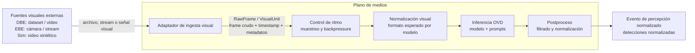

# Justificación arquitectónica: fuentes visuales externas al plano de medios

## Idea central

En la arquitectura general de la plataforma, las cámaras, archivos de video, datasets o fuentes sintéticas deben modelarse como **fuentes visuales externas** al sistema de procesamiento. Esta decisión evita confundir el origen físico o lógico de los datos con el pipeline encargado de transformar esos datos en observaciones procesables.

Por lo tanto, en el diagrama específico del **plano de medios**, no conviene incluir la caja **“Fuente visual”** como si formara parte interna del plano. En su lugar, las fuentes visuales deben quedar por fuera del límite del plano de medios, y el primer componente interno debe ser el encargado de tomar la señal proveniente de esas fuentes y convertirla al contrato común del pipeline.

El nombre propuesto para ese componente es:

> **Adaptador de ingesta visual**

Este nombre es más preciso que “capturador” o “receptor de frames”, porque contempla distintos escenarios de entrada: cámaras reales, videos de dataset, archivos locales, streams RTSP, videos sintéticos o futuras fuentes equivalentes.

---

## Separación de responsabilidades

La separación queda definida de la siguiente manera:

| Elemento | Ubicación arquitectónica | Responsabilidad |
|---|---|---|
| Cámara, dataset, archivo, stream o generador sintético | Fuera del plano de medios | Producir o exponer evidencia visual |
| Adaptador de ingesta visual | Dentro del plano de medios | Recibir, leer, capturar o decodificar la señal visual y convertirla al contrato interno |
| Control de ritmo | Dentro del plano de medios | Regular frecuencia de procesamiento, muestreo y backpressure |
| Normalización visual | Dentro del plano de medios | Ajustar resolución, formato, color, tamaño y condiciones esperadas por el modelo |
| Inferencia OVD | Dentro del plano de medios | Ejecutar el modelo open-vocabulary con prompts configurados |
| Postproceso | Dentro del plano de medios | Filtrar, normalizar y estructurar detecciones |
| Evento de percepción normalizado | Salida del plano de medios | Publicar detecciones normalizadas hacia el resto de la arquitectura |

---

## Flujo conceptual propuesto



---

## Contrato de entrada al plano de medios

No es conveniente afirmar que las fuentes visuales entregan siempre frames raw de manera directa. En la práctica, una cámara real puede exponer un stream comprimido, un dataset puede contener imágenes o videos ya almacenados, un archivo local puede estar codificado en un formato determinado y un generador sintético puede entregar frames ya renderizados.

Por eso, la formulación correcta es:

> El contrato interno del plano de medios comienza después del adaptador de ingesta visual. A partir de ese punto, el pipeline opera sobre unidades visuales crudas normalizadas, compuestas por el frame decodificado, timestamp y metadatos mínimos necesarios para trazabilidad experimental.

Una forma posible de representar ese contrato es:

```text
VisualUnit / RawFrame
- frame_id
- source_id
- timestamp
- width
- height
- pixel_format
- frame_data
- metadata
```

De esta manera, desde el componente **Control de ritmo** en adelante, el pipeline no depende del tipo de fuente original. Solo consume unidades visuales bajo un formato común.

---

## Compatibilidad con los escenarios DBE y EBE

Esta decisión es especialmente útil porque el proyecto contempla más de un escenario experimental.

### Escenario DBE: evaluación basada en datasets

En el escenario DBE, la fuente visual puede ser un dataset, un video descargado, un video sintético o una secuencia de imágenes. En ese caso, el adaptador de ingesta visual actúa como lector o decodificador de archivos.

```text
Dataset / video / imágenes
        ↓
Adaptador de ingesta visual
        ↓
RawFrame / VisualUnit
```

### Escenario EBE: evaluación basada en entorno

En el escenario EBE, la fuente visual puede ser una cámara real, un stream RTSP o una fuente de captura continua. En ese caso, el mismo concepto de adaptador permite encapsular la lógica de conexión, lectura, decodificación y sincronización temporal.

```text
Cámara / stream RTSP / captura continua
        ↓
Adaptador de ingesta visual
        ↓
RawFrame / VisualUnit
```

La ventaja es que ambos escenarios convergen en el mismo contrato interno. Esto permite que el resto del plano de medios se mantenga estable aunque cambie el origen de los datos.

---

## Justificación arquitectónica

Las fuentes visuales deben quedar fuera del plano de medios porque no constituyen una responsabilidad funcional del pipeline, sino el origen externo de la evidencia visual. La plataforma no controla necesariamente cómo se produce esa evidencia: puede provenir de cámaras físicas, datasets, videos sintéticos, archivos locales o streams preexistentes.

Lo que sí corresponde al plano de medios es la lógica que toma esa evidencia y la transforma en una representación uniforme, procesable y trazable. Esa responsabilidad recae sobre el **Adaptador de ingesta visual**.

Esta separación aporta cuatro beneficios principales:

1. **Modularidad**: permite reemplazar una cámara por un dataset, un video sintético o un stream sin modificar la inferencia ni el postproceso.
2. **Reproducibilidad experimental**: facilita ejecutar el mismo pipeline sobre fuentes controladas, archivos repetibles o capturas reales.
3. **Desacoplamiento tecnológico**: evita que el plano de medios dependa de un protocolo o dispositivo específico.
4. **Claridad de responsabilidades**: distingue el origen de los datos del procesamiento interno de la plataforma.

---

## Formulación recomendada para el documento

> En la arquitectura propuesta, las fuentes visuales se modelan como componentes externos al plano de medios. Estas fuentes pueden corresponder a cámaras reales, streams de video, archivos locales, datasets o videos sintéticos, según el escenario experimental considerado. El plano de medios no comienza en la fuente visual, sino en un adaptador de ingesta visual responsable de recibir, leer, capturar o decodificar la señal proveniente de dichas fuentes y transformarla en unidades visuales crudas normalizadas.
>
> A partir de ese punto, el pipeline opera sobre un contrato común compuesto por frames decodificados, timestamps y metadatos mínimos. Esta decisión permite que los escenarios DBE y EBE compartan la misma cadena de procesamiento desde el control de ritmo en adelante, sin acoplar la arquitectura a un tipo particular de cámara, dataset, archivo o protocolo de transmisión. La fuente visual queda por fuera del plano de medios porque representa el origen externo de la evidencia, mientras que el plano de medios concentra las responsabilidades de ingesta, regulación, normalización, inferencia y postproceso necesarias para producir eventos de percepción normalizados.

---

## Versión resumida para acompañar el diagrama

> Las fuentes visuales se consideran externas al plano de medios. El plano comienza en un adaptador de ingesta visual que convierte cámaras, datasets, archivos, streams o videos sintéticos en unidades visuales crudas normalizadas. Desde ese punto, el pipeline procesa frames bajo un contrato común, independiente del origen de los datos.

---